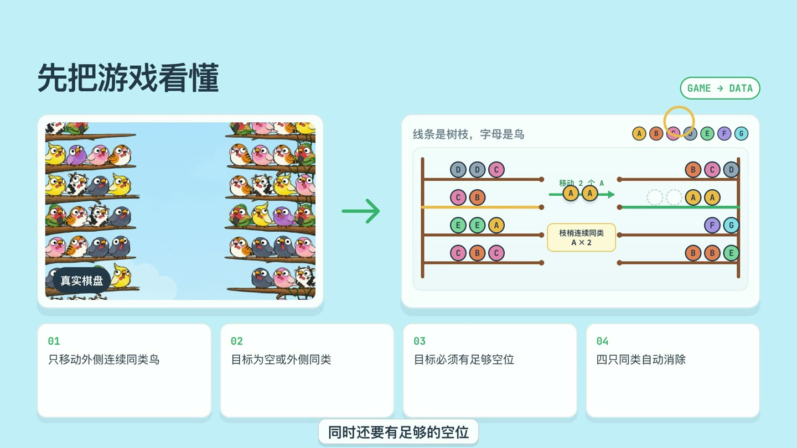
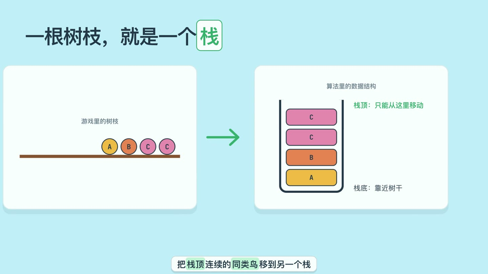
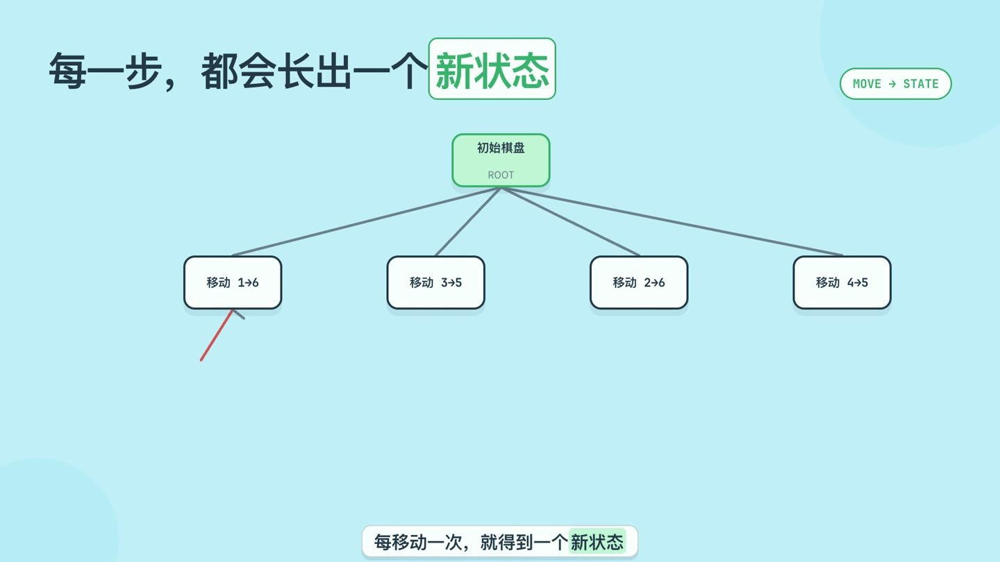
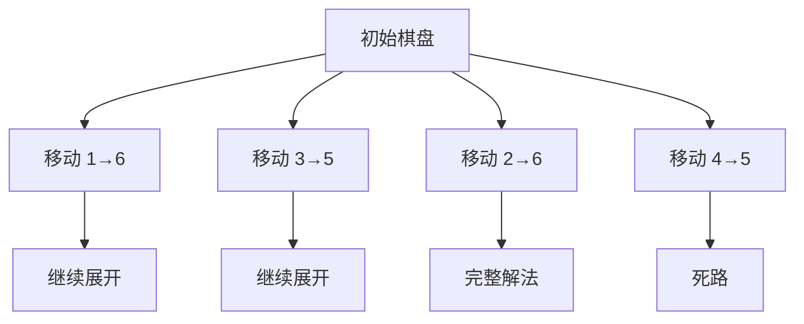
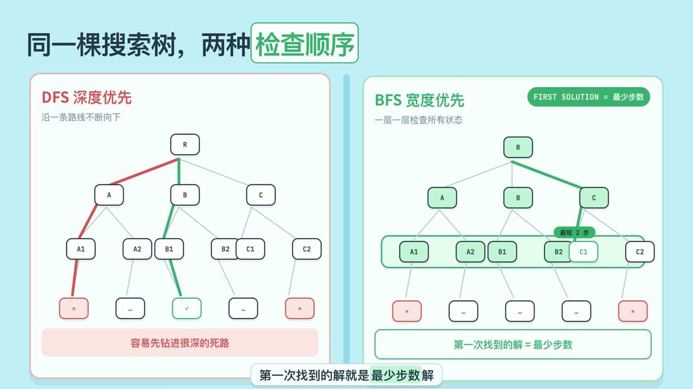
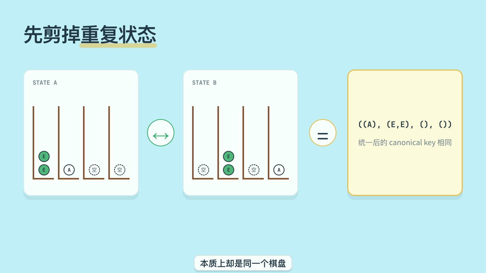
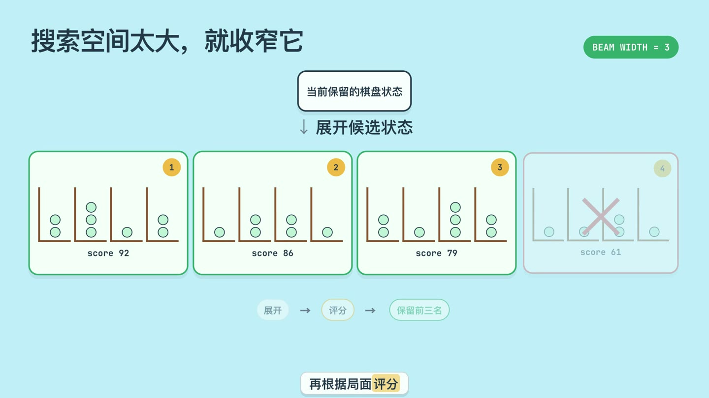
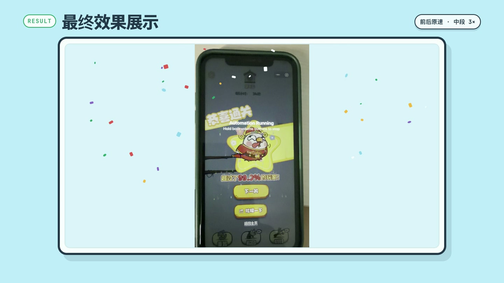

# 总是超时？我用算法自动通关了鸟类消除游戏


玩鸟类消除游戏时，我最常遇到的不是无解，而是**还没想清楚下一步，倒计时就结束了**。眼看只差几步，又一次超时，确实很容易心态崩掉。

既然人的观察和试错速度不够快，能不能把棋盘交给程序，让算法负责搜索路线，再自动执行操作？

这个看似休闲的小游戏，背后正好包含了一套完整的算法问题：

1. 把游戏画面转换成计算机能够处理的数据；
2. 根据规则生成所有合法移动；
3. 在大量棋盘状态中搜索可行解；
4. 通过去重和启发式评分缩小搜索空间；
5. 把求得的路线重新执行到手机上。

本文就从这个真实问题出发，介绍栈、状态搜索、DFS、BFS、剪枝和 Beam Search 是怎样串联起来的。

## 一、先把游戏规则看懂



游戏中的鸟分布在左右两侧的树枝上。每根树枝最多容纳四只鸟，一次移动必须满足下面四条规则：

| 规则 | 含义 |
| --- | --- |
| 只能移动最外侧的鸟 | 被其他鸟挡住的鸟不能直接移动 |
| 连续同类一起移动 | 最外侧有多只相同的鸟时，会作为一组移动 |
| 目标必须兼容 | 目标树枝为空，或最外侧是同类鸟 |
| 目标必须有空间 | 不能超过一根树枝四只鸟的容量 |

当一根树枝集齐四只同类鸟时，整根树枝会自动消除。

鸟的具体颜色、花纹和动画对搜索算法并不重要。为了简化问题，可以把不同鸟类映射为 `A` 到 `G`：

```text
真实鸟类：黄鸟、粉鸟、灰鸟、绿鸟……
算法表示：A、B、C、D、E、F、G
```

从这一刻开始，我们处理的就不再是一张游戏截图，而是一组可以计算的符号。

## 二、一根树枝就是一个栈



每根树枝都可以看作一个栈：

- 靠近树干的一侧是栈底；
- 树枝外侧是栈顶；
- 只能从栈顶取出元素；
- 一次取出栈顶连续的同类元素。

例如，下面这根树枝按“树干到外侧”的顺序存储：

```python
branch = ("A", "B", "C", "C")
```

它的栈顶是最右侧的 `C`，一次操作会取走连续的两个 `C`，而不能直接取走下面的 `A` 或 `B`。

项目中使用不可变数据类保存棋盘：

```python
@dataclass(frozen=True, slots=True)
class BoardState:
    # 每根树枝都按“固定端 -> 可移动端”保存
    branches: tuple[tuple[int, ...], ...]
    capacity: int = 4
```

不可变状态有一个很实用的优势：执行移动时创建新棋盘，而不是原地修改旧棋盘。这样搜索树中的父节点不会被子节点意外污染，也更容易生成哈希键进行去重。

## 三、一次移动，就产生一个新状态



假设当前棋盘有四种合法移动，那么执行每一种移动，都会得到一个不同的新棋盘。这些状态继续展开，就形成一棵搜索树：



其中：

- 节点代表一个完整棋盘状态；
- 边代表一次合法移动；
- 从根节点到某个节点的路径，就是一串可执行操作；
- 没有鸟时，说明所有同类鸟都已成组消除，搜索成功；
- 没有合法移动但仍有鸟时，说明走进了死路。

问题因此变成：**应该以什么顺序检查这棵搜索树？**

## 四、DFS 与 BFS：同一棵树，两种检查顺序



### 深度优先搜索 DFS

DFS 会沿一条路线不断向下，直到成功或走不动，再回退到上一个分叉点。

```text
根节点 → 子节点 → 孙节点 → 更深的节点 → 回退
```

它的优点是内存占用相对较少，也可能很早撞上一条可行路线。但在这个游戏中，局部看起来合理的移动经常会锁死后续空间，DFS 很容易先钻进一条很深的死路。

### 宽度优先搜索 BFS

BFS 会逐层检查状态：

```text
第 0 层：初始棋盘
第 1 层：移动 1 步能到达的全部棋盘
第 2 层：移动 2 步能到达的全部棋盘
……
```

如果每次移动的代价相同，BFS 第一次找到的解就是最少步数解。对于有倒计时的游戏，这一点很重要：步数越少，自动点击和等待动画所需的时间通常也越短。

在视频演示的搜索树中，BFS 按层扫描，在第 2 层到达 `C1` 节点时就找到了完整解法：

```text
R → C → C1
```

这条路径只经过两次移动。因为 BFS 已经检查完所有更浅的状态，所以没有必要继续搜索第 3 层；`C1` 对应的路径就是这棵示例搜索树中的最短解。

| 算法 | 搜索方式 | 优势 | 风险 |
| --- | --- | --- | --- |
| DFS | 沿一条路径深入 | 内存较省，可能较早找到解 | 容易深入死路，不保证最少步数 |
| BFS | 按深度逐层展开 | 首次解是最少步数解 | 状态数量可能快速膨胀 |

遗憾的是，真实棋盘的分支很多，完整 BFS 的内存和时间成本可能难以接受。因此还需要继续优化。

## 五、第一层优化：跳过重复状态



搜索过程中，不同移动顺序可能得到本质相同的棋盘。例如两个空树枝交换位置，不会改变任何后续规则；树枝整体换序，也只是视觉位置不同。

如果把它们当作不同节点重复展开，会浪费大量计算。

项目中的处理方式非常直接：先对所有树枝排序，再把结果作为棋盘的统一标识。

```python
def canonical_key(self) -> tuple[Branch, ...]:
    # 树枝的屏幕位置不影响规则，因此可合并对称状态
    return tuple(sorted(self.branches))
```

搜索时维护一个 `seen` 集合：

```python
key = next_state.canonical_key()
if key in seen:
    continue
seen.add(key)
```

这一步相当于给搜索树剪枝。同一个本质棋盘只展开一次，重复分支直接跳过。

实际实现中还有两条很有效的对称性剪枝：

- 多个空树枝等价，只考虑第一个空树枝作为目标；
- 将一根已经完全同类的树枝搬到空树枝，只是在交换树枝名称，不生成这种无意义移动。

## 六、搜索空间仍然太大：使用 Beam Search



去重能够消除重复状态，却不能阻止不同状态的数量持续增长。为了在有限时间内得到一条足够好的路线，可以使用 Beam Search，也叫束搜索。

它的流程是：


视频为了展示方便，把束宽设为 `3`：每轮展开所有候选、计算分数，然后只保留最有希望的三个状态。

实际程序中的束宽是可配置的：离线分析可以保留更多状态，实机自动操作则使用较小束宽和较短时间限制，以便快速重新规划。

### 状态应该怎样评分？

项目实际使用的是一个词典序评分元组：

```python
return (
    state.removed_count,  # 已经消除的树枝越多越好
    -runs,                # 连续颜色段越少越好
    uniform_weight,       # 同类树枝越完整越好
    -locked_mixed,        # 被填满的混合树枝越少越好
    empty_count,          # 空树枝越多越灵活
)
```

这里最重要的是顺序。Python 会从左到右比较元组，因此“多消除一根树枝”的优先级永远高于后面的局面美化指标。

各项指标的直觉如下：

- **已消除树枝数**：最接近最终目标的直接指标；
- **颜色连续段数**：一根树枝中颜色切换越少，越容易整理；
- **同类聚合程度**：同类鸟聚得越多，越接近消除；
- **锁死的混合树枝**：装满四只却不是同类，通常会限制后续操作；
- **空树枝数**：空位越多，后续搬运空间越充足。

Beam Search 显著降低了搜索时间和内存，但代价也很明确：被提前丢弃的低分状态，未来可能通向更好的解，因此它不再保证找到全局最优路线。

## 七、完整自动化链路

搜索算法只是整个系统的中间部分。要让程序真正完成游戏，还需要把截图识别、求解和设备控制连接起来：


项目不会从头到尾盲目执行一条超长路线，而是采用“规划一批、执行一批、重新截图”的闭环：

1. 识别当前棋盘；
2. 在短时间内搜索一条路线；
3. 连续执行若干步；
4. 一旦有树枝消除或画面与预期不符，立即重新截图；
5. 根据真实新状态重新规划。

这比单纯追求一次性最优解更适合真实手机环境，因为点击可能未生效、动画速度会变化，游戏中还可能出现弹窗或其他中断。

## 八、最终效果展示



最终，算法能够从真实截图中识别棋盘、规划移动并自动完成整局游戏。整个过程可以概括为三层策略：

1. **状态建模**：把树枝表示为栈，把操作表示为状态转移；
2. **减少浪费**：用统一标识跳过重复状态，剪掉对称分支；
3. **控制规模**：用 Beam Search 只保留高分候选，在时间和解题质量之间取得平衡。

最新版视频用完整录屏证明实际效果，而不是只展示一张结果截图：

- 开头 10 秒按正常速度播放，交代执行环境；
- 中间过程以 3 倍速播放，压缩重复操作并保持讲解节奏；
- 最后 10 秒恢复正常速度，完整呈现通关结果；
- 三段都保留录屏原声，结束语出现时适当降低背景声；
- 录屏播放完成后冻结最终画面，并在顶层播放撒花动画。

完整演示视频：


相关代码：

- [棋盘状态与合法移动](./src/suanniao/model.py)
- [Beam Search 求解器](./src/suanniao/solver.py)
- [自动化命令与参数](./src/suanniao/cli.py)
- [Manim 算法演示](./video/beam_search_core.py)

## 结语

算法最有意思的地方，并不是把一个小游戏“暴力破解”，而是把生活中模糊的挫败感拆成可以处理的结构：

> 超时，是时间约束；树枝，是栈；每次移动，是状态转移；反复试错，是搜索；局面太多，则需要剪枝和启发式。

当问题被表示清楚之后，原本令人崩溃的游戏局面，就变成了一个可以观察、计算、优化和验证的问题。
