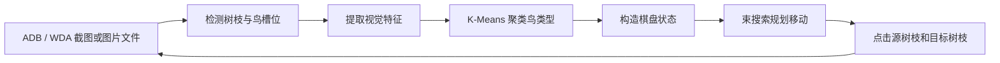

# 算鸟自动玩家：算法设计说明

## 1. 系统目标

程序需要从手机游戏截图出发，自动完成以下闭环：

1. 找到画面中的树枝；
2. 判断每根树枝上有几只鸟，以及哪些鸟属于同一类型；
3. 把截图转换为可搜索的离散棋盘状态；
4. 搜索能够消除尽可能多树枝的移动序列；
5. 通过 Android ADB 或 iPhone WebDriverAgent 点击设备，并在每一步后重新截图和规划。

整体流程如下：



相关实现主要位于：

- [`vision.py` 中的 `BoardRecognizer`](../src/suanniao/vision.py#L81-L286)：截图识别；
- [`model.py` 中的 `BoardState`](../src/suanniao/model.py#L21-L116)：规则和棋盘状态；
- [`solver.py` 中的 `BeamSolver`](../src/suanniao/solver.py#L19-L135)：搜索算法；
- [`controller.py` 中的设备控制器](../src/suanniao/controller.py#L31-L339)：Android ADB 和 iPhone WDA 截图、点击；
- [`cli.py` 中的 `analyze()` 和 `play()`](../src/suanniao/cli.py#L104-L220)：命令行和闭环调度。

## 2. 树枝检测

### 2.1 木材颜色掩码

> 实现位置：[`BoardRecognizer._wood_mask()`](../src/suanniao/vision.py#L288-L300)

树枝在当前皮肤中具有比较稳定的棕色。程序先对每个 RGB 像素应用颜色阈值，得到二值木材掩码：

```text
55 < R < 205
22 < G < 135
B < 95
R - G > 22
```

最后一项用于排除灰色和蓝色区域，使棕色树枝更突出。

这不是通用的目标检测模型，而是一种针对当前游戏皮肤的快速颜色分割方法。它不需要训练数据，计算量也很低。

### 2.2 水平投影

> 实现位置：[`BoardRecognizer._detect_branch_rows()`](../src/suanniao/vision.py#L302-L343)

树枝接近水平，因此可以把二维检测问题转化成一维峰值检测。程序分别在画面左侧和右侧统计每一行的木材像素数量：

$$
S(y)=\sum_{x=x_0}^{x_1} I_{wood}(x,y)
$$

其中 $I_{wood}$ 表示某像素是否通过木材颜色阈值。

对 $S(y)$ 使用短窗口均值卷积进行平滑，然后：

1. 保留得分超过图片宽度 $0.11$ 倍的行；
2. 只搜索图片高度约 24% 到 84% 的游戏区域；
3. 把连续候选行合并为一组；
4. 每组保留得分最高的行作为树枝纵坐标；
5. 对距离过近的候选结果做一次非极大值抑制。

因为所有坐标和阈值大多按图片宽高比例计算，所以同一界面的不同手机分辨率通常可以直接适配。

## 3. 鸟槽位和占用判断

### 3.1 槽位坐标

> 实现位置：[`BoardRecognizer._slot_centers()`](../src/suanniao/vision.py#L345-L354)；调用及槽位记录见 [`BoardRecognizer.read()`](../src/suanniao/vision.py#L118-L133)

每根树枝最多放 4 只鸟。程序检测到树枝纵坐标后，根据截图比例计算 4 个候选槽位。

左侧树枝从屏幕左边的固定端向中间延伸，因此槽位按从左到右保存；右侧树枝从屏幕右边的固定端向中间延伸，因此槽位按从右到左保存。

这种表示保证所有树枝都统一为：

```text
固定端/底部 -> 外端/可移动端
```

所以元组的最后一个元素永远是当前可以移动的鸟。

### 3.2 去木纹的局部前景证据

> 实现位置：[`BoardRecognizer._presence_evidence()`](../src/suanniao/vision.py#L356-L410)

程序在每个候选槽位的鸟身区域取一个小图块，同时从画面中央同高度的天空区域估计背景颜色。背景使用中位数而不是平均数，可以降低云朵、压缩噪声和少量装饰物的影响。

对图块中每个像素计算与背景色的欧氏距离：

$$
d(p,bg)=\sqrt{(R_p-R_{bg})^2+(G_p-G_{bg})^2+(B_p-B_{bg})^2}
$$

首先删除符合第 2.1 节颜色条件的木材像素，避免相邻树枝的一小段木纹被当成鸟。
然后对剩余前景做八邻域连通区域分析，分别计算：

- 去木纹后的前景像素比例 $P_{bird}$；
- 最大连通区域的面积比例 $P_{component}$；
- 最大连通区域相对检测窗口的高度 $H_{component}$。

细长木纹即使仍有少量残留，其连通区域高度也会明显小于真正的鸟。最终槽位分数为：

$$
P=0.55P_{bird}+0.25P_{component}+0.20H_{component}
$$

### 3.3 树枝前缀和全局数量约束

> 实现位置：[`BoardRecognizer._threshold_occupancy()`](../src/suanniao/vision.py#L412-L418) 和 [`BoardRecognizer._select_occupancies()`](../src/suanniao/vision.py#L420-L442)

每根树枝只允许选择 `0～4` 只连续鸟，即占用槽位必须构成从固定端开始的前缀。
程序同时选择所有树枝的鸟数，使槽位置信度总和最大，并施加：

$$
\sum_b n_b\equiv0\pmod 4
$$

因为游戏移动不会改变鸟总数，树枝消除时也总是一次移除 4 只，所以任何稳定棋盘上的
可见鸟总数都应是 4 的倍数。动态规划会在几个临界槽位之间选择代价最小的修正，避免
单个 `0.204` 之类的边缘分数让总数变成 77。

## 4. 鸟类型识别

### 4.1 为什么使用无监督聚类

> 实现位置：[`BoardRecognizer._cluster_candidates()`](../src/suanniao/vision.py#L588-L646)

求解器只需要知道两只鸟是否完全相同，并不需要知道它们叫“黄色鸟”“奶牛鸟”还是“鹦鹉”。因此当前实现没有训练分类模型，而是对同一张截图中的所有鸟进行无监督聚类。

聚类标签只是临时编号，例如 `0、1、2`。只要相同鸟得到相同编号，搜索算法就可以正常工作。

### 4.2 朝向归一化

> 实现位置：[`BoardRecognizer._bird_crop_box()`](../src/suanniao/vision.py#L444-L470) 和 [`BoardRecognizer._bird_crop()`](../src/suanniao/vision.py#L472-L514)

左右两侧的鸟朝向相反。如果直接比较图像，同一种鸟可能会因为镜像而被分成两类。

程序把右侧鸟的图块进行水平翻转，使左右两侧鸟的朝向一致，然后统一缩放为 `49 × 62` 像素。

槽位定位点相对鸟身体的稳定特征区域略偏向屏幕边缘，因此裁剪框整体向屏幕中央偏移图片
宽度的 `0.006`：左侧向右、右侧向左。对于外侧仍有邻鸟的槽位，再向树枝固定端补偿
图片宽度的 `0.002`，降低相邻鸟进入裁剪框的比例。裁剪半宽使用图片宽度的 `0.040`。
最靠屏幕边缘的槽位会进一步限制裁剪中心，使完整矩形保持在截图内：左侧框向右、右侧框
向左，避免外侧鸟身体被截断。其他偶发越界区域使用估计的天空色填充，而不是 Pillow
默认的黑色填充。

### 4.3 中央可见区域

> 实现位置：[`BoardRecognizer._background_color()`](../src/suanniao/vision.py#L516-L523) 和 [`BoardRecognizer._bird_feature_mask()`](../src/suanniao/vision.py#L525-L538)；特征掩码调试图输出见 [`_write_detection_debug()`](../src/suanniao/vision.py#L772-L841)

树枝上的鸟会互相遮挡，最外侧鸟还可能带有绳索、相邻鸟或树枝纹理。如果使用整个裁剪图，
聚类容易按照槽位和遮挡方式分组，而不是按照鸟类型分组。

程序只分析图块中央的椭圆区域。这个区域覆盖鸟的头部和主体颜色，同时避开两侧相邻鸟及
底部树枝。再使用截图中央空白区域估计天空背景色，过滤与背景颜色距离过近的像素。
调试报告会并排保存标准化裁剪和最终特征掩码，便于确认邻鸟是否真正进入聚类特征。

### 4.4 语义颜色比例特征

> 实现位置：[`BoardRecognizer._bird_feature_from_crop()`](../src/suanniao/vision.py#L540-L586)

游戏中的鸟主要由稳定的颜色组合区分，例如黑白奶牛鸟、橙白鸟、红绿鹦鹉、紫色鸟和
深灰色鸟。程序把中央前景像素转换到 HSV 空间，统计以下 9 种颜色成分的比例：

```text
黑、白、中性灰、红、橙、黄、绿、蓝、紫
```

最终每只鸟使用 9 维语义颜色向量。这比原来的全图 RGB 直方图更不容易受到邻鸟遮挡影响，
也能明确区分“黑白与橙白”“绿色与红绿色”等容易混淆的组合。

### 4.5 容量约束 K-Means 与鸟类数量推断

> 实现位置：[`_cluster_candidates()`](../src/suanniao/vision.py#L588-L646)、[`_capacity_target_candidates()`](../src/suanniao/vision.py#L648-L684)、[`_capacity_targets()`](../src/suanniao/vision.py#L686-L718)、[`_constrained_assignment()`](../src/suanniao/vision.py#L720-L754) 和 [`_select_cluster()`](../src/suanniao/vision.py#L756-L764)

对所有鸟的特征向量执行 K-Means。K-Means 的目标是最小化类内平方距离：

$$
\min \sum_{i=1}^{k}\sum_{x\in C_i}\|x-\mu_i\|^2
$$

如果用户没有通过 `--types` 指定鸟类数量，程序会尝试多个 $k$，默认最多尝试 10 类。

普通 K-Means 不限制每一类的样本数量，可能产生 `10、8、6` 这样的分组。
当前实现会为普通 K-Means 生成一组接近原始组大小的合法容量候选。每个容量必须是
正的 4 的倍数，并且所有容量之和等于鸟总数。例如：

```text
普通 K-Means: 8, 12, 8, 10, 8, 8, 8, 2
合法目标容量: 8, 12, 8,  8, 8, 8, 8, 4
```

动态规划保留组大小变化代价最低的多个候选：

$$
\min \sum_j (q_j-|C_j|)^2
$$

约束为：

$$
q_j\in\{4,8,12,\ldots\},\qquad \sum_jq_j=N
$$

对于这些候选，程序将每个聚类中心复制成对应数量的“槽位”，以鸟到中心的平方距离作为
代价，使用匈牙利算法计算全局分配成本，再选择视觉分配成本最低的容量组合。这可以解决
`6、14` 同时投影为 `4、16` 或 `8、12` 时仅靠数量变化代价无法判断的问题。选定容量后，
重新计算聚类中心并重复分配，直到标签稳定或达到迭代上限。

这和“普通 K-Means 完成后再检查数量”不同：容量约束直接参与了鸟的分配过程，即使原始
K-Means 的组大小不是 4 的倍数，也可以把距离聚类边界最近的鸟调整到合适的类别。

对约束后的候选结果使用轮廓系数评价聚类质量：

$$
s(i)=\frac{b(i)-a(i)}{\max(a(i),b(i))}
$$

其中：

- $a(i)$ 是样本与本类其他样本的平均距离；
- $b(i)$ 是样本与最近其他类样本的平均距离。

为了避免把同一种鸟过度拆分成很多小类，实际选择分数为：

$$
quality=silhouette-0.002k
$$

最终选择质量最高的容量约束结果。程序仍会执行一次 4 倍数校验，作为算法正确性的保护。

在示例截图中，程序自动识别出 7 类鸟，聚类大小为：

```text
8, 8, 8, 8, 8, 12, 12
```

总数为 64，所有类别数量都满足 4 的倍数约束。

## 5. 棋盘状态建模

### 5.1 树枝表示

> 实现位置：[`Bird`、`Branch` 和 `REMOVED`](../src/suanniao/model.py#L6-L10)；[`BoardState`](../src/suanniao/model.py#L21-L47)

一根树枝使用不可变元组表示：

```python
(0, 3, 2, 2)
```

它表示从固定端到外端依次是 `0、3、2、2`，可移动端有两个连续的 `2`。

整个棋盘是所有树枝组成的元组。使用不可变数据结构有利于：

- 计算哈希和保存已访问状态；
- 避免搜索分支之间互相修改；
- 安全地生成下一状态。

一根已经凑齐 4 只同类鸟并消失的树枝使用特殊值 `(-1,)` 表示。它与空树枝 `()` 不同：

- `()` 仍然可以接收鸟；
- `(-1,)` 已从棋盘消失，不能再使用。

### 5.2 可移动连续段

> 实现位置：[`BoardState.legal_moves()`](../src/suanniao/model.py#L49-L90) 和 [`BoardState.apply()`](../src/suanniao/model.py#L92-L116)

对源树枝，从元组末尾开始统计连续同类鸟数量 $r$。例如：

```text
(0, 3, 2, 2) 的外端连续段长度 r = 2
```

目标树枝必须满足以下条件之一：

- 是空树枝；
- 外端鸟与源树枝外端鸟相同。

若目标剩余容量为 $c$，实际移动数量为：

$$
m=\min(r,c)
$$

这与游戏点击一次后自动搬运尽可能多连续同类鸟的行为一致。

当目标树枝移动后恰好包含 4 只完全相同的鸟时，目标树枝立即变为已消除状态。

## 6. 状态空间剪枝

如果直接枚举所有移动，搜索树会快速膨胀。当前实现使用了三项重要剪枝。

### 6.1 对称状态归一化

> 实现位置：[`BoardState.canonical_key()`](../src/suanniao/model.py#L44-L47)；搜索去重见 [`BeamSolver.solve()`](../src/suanniao/solver.py#L41-L62)

从规则角度看，树枝的屏幕位置不影响解题。例如交换两根空树枝不会产生新局面。

程序对所有树枝元组排序，生成规范化键：

```python
canonical_key = tuple(sorted(branches))
```

搜索使用规范化键记录已经访问的状态，但仍在搜索节点中保留原始树枝编号，因此最后得到的移动序列仍然可以映射到真实点击坐标。

### 6.2 等价空树枝剪枝

> 实现位置：[`BoardState.legal_moves()` 中的 `first_empty` 选择](../src/suanniao/model.py#L49-L80)

如果有多根空树枝，把同一组鸟移动到任意一根空树枝得到的状态彼此对称。因此只考虑第一根空树枝作为目标。

### 6.3 无效搬家剪枝

> 实现位置：[`BoardState.legal_moves()` 中的 `source_is_uniform` 判断](../src/suanniao/model.py#L60-L80)

若源树枝本身全部是同一种鸟，把它整体移动到空树枝只相当于交换了源树枝和空树枝的位置，不会改善棋盘。因此这种移动不进入搜索树。

## 7. 束搜索求解器

### 7.1 为什么不使用纯贪心

> 实现位置：[`BeamSolver`](../src/suanniao/solver.py#L19-L135)

只优先执行“眼前能凑成 4 只”的移动可能会把关键空间占满，导致深层鸟无法释放。这个游戏需要保留多个可能的未来局面，因此当前实现使用束搜索，而不是只保留一个贪心路径。

### 7.2 基本过程

> 实现位置：[`BeamSolver.__init__()`](../src/suanniao/solver.py#L22-L33) 和 [`BeamSolver.solve()`](../src/suanniao/solver.py#L35-L101)

束搜索按移动步数逐层展开，但每层只保留评分最高的 $B$ 个状态：

```text
beam = {初始状态}
重复直到达到最大深度：
    candidates = 展开 beam 中所有合法移动
    去除已经访问的规范化状态
    如果找到清空状态，则返回完整路径
    按评分排序，只保留前 B 个状态作为下一层 beam
```

默认参数为：

```text
beam_width = 2000
max_depth = 80
time_limit = 20 秒
```

如果在限制内不能完全清空，求解器会返回搜索期间找到的最佳方案，而不是随机移动。

### 7.3 状态评分

> 实现位置：[`BeamSolver._rank()`](../src/suanniao/solver.py#L103-L134)

每个状态使用以下字典序评分：

```python
(
    已消除树枝数,
    -颜色连续段总数,
    同色树枝权重,
    -已塞满的混色树枝数,
    空树枝数,
)
```

字典序意味着“多消除一根树枝”永远优先于其他局部改进，符合“尽可能多消除树枝”的目标。

#### 连续段总数

树枝 $b=(b_1,b_2,\ldots,b_n)$ 的连续段数量为：

$$
runs(b)=1+\sum_{i=2}^{n}[b_i\ne b_{i-1}]
$$

连续段越少，说明同类鸟聚集得越好。

#### 同色树枝权重

若一根树枝当前只有一种鸟，加入其长度平方：

$$
uniform\_weight(b)=|b|^2
$$

平方权重会更偏好把同类鸟集中到一根较长的树枝，而不是分散在多根短树枝上。

#### 塞满的混色树枝

容量已经达到 4、但内部仍有多种鸟的树枝无法继续接收鸟，通常需要额外步骤才能解锁，因此评分会对这种状态进行惩罚。

## 8. 时间与空间复杂度

> 对应实现：合法移动枚举见 [`BoardState.legal_moves()`](../src/suanniao/model.py#L49-L90)，逐层展开、排序与束宽截断见 [`BeamSolver.solve()`](../src/suanniao/solver.py#L48-L91)

这个问题本质上仍是指数级状态搜索。设：

- $D$ 为最大搜索深度；
- $B$ 为束宽；
- $M$ 为树枝数量。

一个状态最多需要检查约 $M(M-1)$ 个源和目标组合，因此单层展开的粗略复杂度为：

$$
O(BM^2)
$$

再考虑候选状态排序，总体近似为：

$$
O\left(D\left(BM^2+C\log C\right)\right)
$$

其中 $C$ 是某层生成的候选状态数。

规范化、去重和固定束宽不会改变问题最坏情况下的指数性质，但能把实际内存和运行时间控制在可用范围内。示例截图使用束宽 1000 时，约 3 秒即可找到 46 步完整解。

束搜索是一种有界启发式搜索：它追求高质量解，但在束宽或时间受限时不保证数学意义上的最短路径，也不保证已经证明最优。如果扩大 `--beam-width` 和 `--time-limit`，通常可以提高困难关卡的解题能力。

## 9. 设备自动化闭环控制

> 实现位置：[`DeviceController`](../src/suanniao/controller.py#L31-L47)、[`AdbController`](../src/suanniao/controller.py#L83-L133)、[`WdaController`](../src/suanniao/controller.py#L136-L377) 和 [`cli.play()`](../src/suanniao/cli.py#L245-L364)

Android 使用 ADB 的 `screencap` 和 `input tap`；iPhone 使用 WebDriverAgent
的截图、窗口尺寸和触摸 HTTP 接口。两种后端对上层识别器和求解器提供相同的
截图和游戏内点击能力，因此识别、搜索和批量调度逻辑不需要区分手机平台。
检测到非棋盘画面时，自动执行流程不会查询或点击任何关闭控件，只记录日志并等待人工处理。

iPhone 的截图尺寸通常是 Retina 像素，而 WDA 点击坐标使用逻辑点。若截图尺寸为
$(W_i,H_i)$，WDA 返回的窗口尺寸为 $(W_s,H_s)$，截图点击坐标 $(x,y)$ 会转换为：

$$
x_s=round\left(x\frac{W_s}{W_i}\right),\qquad
y_s=round\left(y\frac{H_s}{H_i}\right)
$$

这样可自动适配 2x、3x Retina 缩放及不同尺寸的 iPhone。

### 9.1 稳定截图检测

> 实现位置：[`StableCaptureMixin.capture_stable()`](../src/suanniao/controller.py#L45-L75)

动画过程中截图可能出现鸟正在飞行、树枝正在消失等中间状态。程序连续获取截图，只比较高度 25% 到 84% 的棋盘区域，并计算两帧平均像素差：

$$
diff=mean(|I_t-I_{t-1}|)
$$

当 `diff <= 1.5` 时认为棋盘已经稳定。通用接口默认最多尝试 8 次、每次间隔
0.25 秒；实时 `play` 为减少等待，使用最多 5 次、每次间隔 0.10 秒。

### 9.2 批量滚动规划与虚拟棋盘

> 实现位置：[`cli.play()`](../src/suanniao/cli.py#L245-L364)；树枝点击坐标见 [`DetectedBranch.click_point()`](../src/suanniao/vision.py#L37-L42)

早期实现每移动一步就重新执行稳定截图、完整视觉识别和束搜索，容错性高，但在有时间限制
的关卡中，大量时间消耗在重复聚类与搜索。当前实现采用有上限的批量滚动规划：

1. 获取稳定截图；
2. 重新识别整个棋盘；
3. 重新搜索；
4. 默认取方案前 8 步形成当前批次，但遇到第一步会消除树枝的移动时就在该步截断；
5. 依次点击源树枝和目标树枝，两次点击间隔默认 0.12 秒，普通移动后默认等待 0.30 秒，消除树枝后等待 0.55 秒；
6. 批次达到 8 步或消除任意一根树枝后，立即返回步骤 1，重新识别并修正误差。

批量执行期间不能继续使用首次截图中每根树枝的鸟数决定点击槽位，因为前一步移动会改变
源和目标树枝的最外侧位置。程序在内存中维护一个 `virtual_state`，每执行一步就调用
`BoardState.apply(move)` 更新虚拟棋盘，再用当前树枝长度选择实际点击槽位。树枝的屏幕位置
仍沿用批次开始时检测到的坐标。由于树枝消失可能改变后续编号或布局，完成消除的移动永远
是当前批次最后一步，不会继续使用消除前的旧坐标。

从第二步开始，每一步之前会调用一次快速 `capture()`，检查棋盘存在性，并执行不写调试文件
的视觉识别，将保留物理位置但忽略聚类编号差异的状态键与 `virtual_state` 比较。若点击没有
生效、源鸟仍处于选中状态或广告造成状态漂移，程序会立即停止剩余点击，点击中央空白区域
清除残留选择，再重新截图规划。程序仅在首次开始、状态与预期不一致或中断恢复后执行中性
点击；状态已经验证正确的正常批次不会重复清空选择。
默认实时搜索束宽由离线分析的 2000 降为 120，搜索时限由 20 秒降为 2 秒。已保存的
64～76 鸟测试截图在束宽 120 下约 0.2～0.7 秒找到完整方案。

iOS 控制器会在截图分辨率未变化时复用 WDA 窗口逻辑尺寸，避免每轮点击前重复查询
`window/rect`。截图和点击端点首次探测成功后也会缓存；只有已缓存端点调用失败时才重新
尝试兼容路径。这些优化只减少设备 HTTP 往返，不改变坐标换算、识别或求解结果。

这种方式可以适应：

- 每批结束后的树枝消失和画面变化；
- 广告在批量执行中途出现；
- 通过下一批重新识别修正少量视觉误差。

批量执行以速度换取了一部分逐步校验能力。如果设备动画较慢，可增大 `--move-wait` 和
`--elimination-wait`；如果点击偶发不生效，可减小 `--moves-per-plan`，最保守时设为 1。
如果两个批次后规范化棋盘仍然没有变化，程序会停止并报错，避免失控地重复点击。

### 9.3 棋盘缺失与广告恢复

> 实现位置：[`BoardRecognizer.has_game_board()`](../src/suanniao/vision.py) 和 [`cli._capture_game_board()`](../src/suanniao/cli.py)

关闭按钮检测由棋盘检测保护，不会在正常游戏画面中运行。轻量棋盘检测只执行树枝行定位，
两侧合计至少检测到两根树枝时认为当前是正常棋盘。这里不要求左右两侧必须同时有树枝，
因为关卡接近结束时，剩余树枝可能恰好全部位于同一侧。少于两根树枝的画面不会进入完整
鸟切割和聚类流程，而是按中断画面处理。

若条件不满足，程序把画面保存为 `turn-NNN-interruption-NNN.png` 并输出日志，不查询
WDA 可访问性树，也不发送关闭或跳过点击。用户手动处理弹窗后，程序继续轮询截图；重新
检测到棋盘时自动恢复识别和游戏内操作。

棋盘门禁同时采样顶部天空区域的亮度，以拒绝广告或超时弹窗产生的全屏变暗遮罩。正式回合
之间还会检查状态摘要：由于批量执行会在首次消除树枝后停止，下一回合只允许树枝数和鸟数
保持不变，或分别减少 1 和 4。超出该范围的识别结果保存为
`turn-NNN-suspicious-board-NNN.png` 并按中断处理。

程序按默认 0.8 秒间隔持续检查，最长等待 300 秒。棋盘恢复后自动重新识别、规划并继续
运行。批量执行中检测到棋盘消失时，会立即丢弃当前批次剩余方案，下一轮进入同一恢复流程。
求解器首次返回空移动序列时不会立即退出，只有连续稳定截图得到相同无移动状态后才停止。

## 10. 示例截图结果

> 对应入口：[`cli.analyze()`](../src/suanniao/cli.py#L104-L159)；命令行参数定义见 [`build_parser()`](../src/suanniao/cli.py#L223-L300)

对项目根目录中的 `game.jpg`，当前实现得到：

```text
树枝数量：18
鸟数量：64
鸟类型：7
可消除组数：16 / 16
完整方案：46 步
```

可以使用以下命令复现：

```bash
PYTHONPATH=src python3 -m suanniao analyze game.jpg --beam-width 1000
```

`analyze` 会同时把树枝检测标注图 `01-detection.png`、标准化鸟裁剪、特征掩码、
聚类候选图和 `report.json` 保存到截图旁的 `game-clusters/`。传入 `--debug-dir`
可以覆盖默认输出目录。

## 11. 当前限制与后续改进

### 当前限制

- 木材颜色阈值针对当前游戏皮肤，换皮肤后可能需要调整；
- 槽位位置按当前竖屏布局比例计算；
- K-Means 每次截图独立聚类，没有跨帧保存鸟类型模板；
- 束搜索受束宽和时间限制，不保证最短解；
- 实际点击依赖 ADB 或 WebDriverAgent、手机分辨率和游戏对点击区域的响应。

### 可继续改进的方向

- 保存首帧聚类中心，在后续帧中做最近邻分类，提高跨帧稳定性；
- 使用模板匹配、轻量 CNN 或孪生网络替代颜色特征，以适配更多皮肤；
- 自动学习树枝和槽位布局，减少固定比例参数；
- 为搜索加入死锁模式识别和更强的可解性下界；
- 对候选路径进行二次优化，在能清空的前提下减少点击步数；
- 增加点击后的局部状态验证和自动坐标校准。
