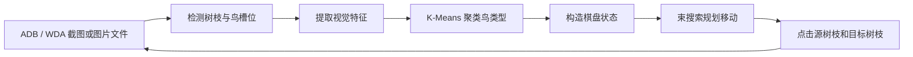

# 算鸟自动玩家：算法设计说明

## 1. 系统目标

程序需要从手机游戏截图出发，自动完成以下闭环：

1. 找到画面中的树枝；
2. 判断每根树枝上有几只鸟，以及哪些鸟属于同一类型；
3. 把截图转换为可搜索的离散棋盘状态；
4. 搜索能够消除尽可能多树枝的移动序列；
5. 通过 Android ADB 或 iPhone WebDriverAgent 点击设备，并在每一步后重新截图和规划。

整体流程如下：



相关实现主要位于：

- `src/suanniao/vision.py`：截图识别；
- `src/suanniao/model.py`：规则和棋盘状态；
- `src/suanniao/solver.py`：搜索算法；
- `src/suanniao/controller.py`：Android ADB 和 iPhone WDA 截图、点击；
- `src/suanniao/cli.py`：命令行和闭环调度。

## 2. 树枝检测

### 2.1 木材颜色掩码

树枝在当前皮肤中具有比较稳定的棕色。程序先对每个 RGB 像素应用颜色阈值，得到二值木材掩码：

```text
55 < R < 205
22 < G < 135
B < 95
R - G > 22
```

最后一项用于排除灰色和蓝色区域，使棕色树枝更突出。

这不是通用的目标检测模型，而是一种针对当前游戏皮肤的快速颜色分割方法。它不需要训练数据，计算量也很低。

### 2.2 水平投影

树枝接近水平，因此可以把二维检测问题转化成一维峰值检测。程序分别在画面左侧和右侧统计每一行的木材像素数量：

$$
S(y)=\sum_{x=x_0}^{x_1} I_{wood}(x,y)
$$

其中 $I_{wood}$ 表示某像素是否通过木材颜色阈值。

对 $S(y)$ 使用短窗口均值卷积进行平滑，然后：

1. 保留得分超过图片宽度 $0.11$ 倍的行；
2. 只搜索图片高度约 24% 到 84% 的游戏区域；
3. 把连续候选行合并为一组；
4. 每组保留得分最高的行作为树枝纵坐标；
5. 对距离过近的候选结果做一次非极大值抑制。

因为所有坐标和阈值大多按图片宽高比例计算，所以同一界面的不同手机分辨率通常可以直接适配。

## 3. 鸟槽位和占用判断

### 3.1 槽位坐标

每根树枝最多放 4 只鸟。程序检测到树枝纵坐标后，根据截图比例计算 4 个候选槽位。

左侧树枝从屏幕左边的固定端向中间延伸，因此槽位按从左到右保存；右侧树枝从屏幕右边的固定端向中间延伸，因此槽位按从右到左保存。

这种表示保证所有树枝都统一为：

```text
固定端/底部 -> 外端/可移动端
```

所以元组的最后一个元素永远是当前可以移动的鸟。

### 3.2 局部背景差分

程序在每个候选槽位的鸟身区域取一个小图块，同时从画面中央同高度的天空区域估计背景颜色。背景使用中位数而不是平均数，可以降低云朵、压缩噪声和少量装饰物的影响。

对图块中每个像素计算与背景色的欧氏距离：

$$
d(p,bg)=\sqrt{(R_p-R_{bg})^2+(G_p-G_{bg})^2+(B_p-B_{bg})^2}
$$

定义占用分数：

$$
P_{occupied}=\frac{\#\{p\mid d(p,bg)>45\}}{\#\{p\}}
$$

当占用分数不小于 0.20 时，认为槽位中存在一只鸟。由于鸟总是从树枝固定端连续排列，遇到第一个空槽位后即可停止检测该树枝的后续槽位。

## 4. 鸟类型识别

### 4.1 为什么使用无监督聚类

求解器只需要知道两只鸟是否完全相同，并不需要知道它们叫“黄色鸟”“奶牛鸟”还是“鹦鹉”。因此当前实现没有训练分类模型，而是对同一张截图中的所有鸟进行无监督聚类。

聚类标签只是临时编号，例如 `0、1、2`。只要相同鸟得到相同编号，搜索算法就可以正常工作。

### 4.2 朝向归一化

左右两侧的鸟朝向相反。如果直接比较图像，同一种鸟可能会因为镜像而被分成两类。

程序把右侧鸟的图块进行水平翻转，使左右两侧鸟的朝向一致，然后统一缩放为 `49 × 62` 像素。

### 4.3 中央可见区域

树枝上的鸟会互相遮挡，最外侧鸟还可能带有绳索、相邻鸟或树枝纹理。如果使用整个裁剪图，
聚类容易按照槽位和遮挡方式分组，而不是按照鸟类型分组。

程序只分析图块中央的椭圆区域。这个区域覆盖鸟的头部和主体颜色，同时避开两侧相邻鸟及
底部树枝。再使用截图中央空白区域估计天空背景色，过滤与背景颜色距离过近的像素。

### 4.4 语义颜色比例特征

游戏中的鸟主要由稳定的颜色组合区分，例如黑白奶牛鸟、橙白鸟、红绿鹦鹉、紫色鸟和
深灰色鸟。程序把中央前景像素转换到 HSV 空间，统计以下 9 种颜色成分的比例：

```text
黑、白、中性灰、红、橙、黄、绿、蓝、紫
```

最终每只鸟使用 9 维语义颜色向量。这比原来的全图 RGB 直方图更不容易受到邻鸟遮挡影响，
也能明确区分“黑白与橙白”“绿色与红绿色”等容易混淆的组合。

### 4.5 容量约束 K-Means 与鸟类数量推断

对所有鸟的特征向量执行 K-Means。K-Means 的目标是最小化类内平方距离：

$$
\min \sum_{i=1}^{k}\sum_{x\in C_i}\|x-\mu_i\|^2
$$

如果用户没有通过 `--types` 指定鸟类数量，程序会尝试多个 $k$，默认最多尝试 10 类。

普通 K-Means 不限制每一类的样本数量，可能产生 `10、8、6` 这样的分组。
当前实现会把普通 K-Means 的组大小投影到距离最近的合法容量组合。每个容量必须是
正的 4 的倍数，并且所有容量之和等于鸟总数。例如：

```text
普通 K-Means: 8, 12, 8, 10, 8, 8, 8, 2
合法目标容量: 8, 12, 8,  8, 8, 8, 8, 4
```

目标容量通过动态规划求得，优化目标是尽可能少地改变普通 K-Means 的组大小：

$$
\min \sum_j (q_j-|C_j|)^2
$$

约束为：

$$
q_j\in\{4,8,12,\ldots\},\qquad \sum_jq_j=N
$$

确定容量后，将每个聚类中心复制成对应数量的“槽位”，以鸟到中心的平方距离作为代价，
使用匈牙利算法求全局最小代价分配。因此每个中心会精确获得目标数量的鸟。随后重新计算
聚类中心并重复分配，直到标签稳定或达到迭代上限。

这和“普通 K-Means 完成后再检查数量”不同：容量约束直接参与了鸟的分配过程，即使原始
K-Means 的组大小不是 4 的倍数，也可以把距离聚类边界最近的鸟调整到合适的类别。

对约束后的候选结果使用轮廓系数评价聚类质量：

$$
s(i)=\frac{b(i)-a(i)}{\max(a(i),b(i))}
$$

其中：

- $a(i)$ 是样本与本类其他样本的平均距离；
- $b(i)$ 是样本与最近其他类样本的平均距离。

为了避免把同一种鸟过度拆分成很多小类，实际选择分数为：

$$
quality=silhouette-0.002k
$$

最终选择质量最高的容量约束结果。程序仍会执行一次 4 倍数校验，作为算法正确性的保护。

在示例截图中，程序自动识别出 7 类鸟，聚类大小为：

```text
8, 8, 8, 8, 8, 12, 12
```

总数为 64，所有类别数量都满足 4 的倍数约束。

## 5. 棋盘状态建模

### 5.1 树枝表示

一根树枝使用不可变元组表示：

```python
(0, 3, 2, 2)
```

它表示从固定端到外端依次是 `0、3、2、2`，可移动端有两个连续的 `2`。

整个棋盘是所有树枝组成的元组。使用不可变数据结构有利于：

- 计算哈希和保存已访问状态；
- 避免搜索分支之间互相修改；
- 安全地生成下一状态。

一根已经凑齐 4 只同类鸟并消失的树枝使用特殊值 `(-1,)` 表示。它与空树枝 `()` 不同：

- `()` 仍然可以接收鸟；
- `(-1,)` 已从棋盘消失，不能再使用。

### 5.2 可移动连续段

对源树枝，从元组末尾开始统计连续同类鸟数量 $r$。例如：

```text
(0, 3, 2, 2) 的外端连续段长度 r = 2
```

目标树枝必须满足以下条件之一：

- 是空树枝；
- 外端鸟与源树枝外端鸟相同。

若目标剩余容量为 $c$，实际移动数量为：

$$
m=\min(r,c)
$$

这与游戏点击一次后自动搬运尽可能多连续同类鸟的行为一致。

当目标树枝移动后恰好包含 4 只完全相同的鸟时，目标树枝立即变为已消除状态。

## 6. 状态空间剪枝

如果直接枚举所有移动，搜索树会快速膨胀。当前实现使用了三项重要剪枝。

### 6.1 对称状态归一化

从规则角度看，树枝的屏幕位置不影响解题。例如交换两根空树枝不会产生新局面。

程序对所有树枝元组排序，生成规范化键：

```python
canonical_key = tuple(sorted(branches))
```

搜索使用规范化键记录已经访问的状态，但仍在搜索节点中保留原始树枝编号，因此最后得到的移动序列仍然可以映射到真实点击坐标。

### 6.2 等价空树枝剪枝

如果有多根空树枝，把同一组鸟移动到任意一根空树枝得到的状态彼此对称。因此只考虑第一根空树枝作为目标。

### 6.3 无效搬家剪枝

若源树枝本身全部是同一种鸟，把它整体移动到空树枝只相当于交换了源树枝和空树枝的位置，不会改善棋盘。因此这种移动不进入搜索树。

## 7. 束搜索求解器

### 7.1 为什么不使用纯贪心

只优先执行“眼前能凑成 4 只”的移动可能会把关键空间占满，导致深层鸟无法释放。这个游戏需要保留多个可能的未来局面，因此当前实现使用束搜索，而不是只保留一个贪心路径。

### 7.2 基本过程

束搜索按移动步数逐层展开，但每层只保留评分最高的 $B$ 个状态：

```text
beam = {初始状态}
重复直到达到最大深度：
    candidates = 展开 beam 中所有合法移动
    去除已经访问的规范化状态
    如果找到清空状态，则返回完整路径
    按评分排序，只保留前 B 个状态作为下一层 beam
```

默认参数为：

```text
beam_width = 2000
max_depth = 80
time_limit = 20 秒
```

如果在限制内不能完全清空，求解器会返回搜索期间找到的最佳方案，而不是随机移动。

### 7.3 状态评分

每个状态使用以下字典序评分：

```python
(
    已消除树枝数,
    -颜色连续段总数,
    同色树枝权重,
    -已塞满的混色树枝数,
    空树枝数,
)
```

字典序意味着“多消除一根树枝”永远优先于其他局部改进，符合“尽可能多消除树枝”的目标。

#### 连续段总数

树枝 $b=(b_1,b_2,\ldots,b_n)$ 的连续段数量为：

$$
runs(b)=1+\sum_{i=2}^{n}[b_i\ne b_{i-1}]
$$

连续段越少，说明同类鸟聚集得越好。

#### 同色树枝权重

若一根树枝当前只有一种鸟，加入其长度平方：

$$
uniform\_weight(b)=|b|^2
$$

平方权重会更偏好把同类鸟集中到一根较长的树枝，而不是分散在多根短树枝上。

#### 塞满的混色树枝

容量已经达到 4、但内部仍有多种鸟的树枝无法继续接收鸟，通常需要额外步骤才能解锁，因此评分会对这种状态进行惩罚。

## 8. 时间与空间复杂度

这个问题本质上仍是指数级状态搜索。设：

- $D$ 为最大搜索深度；
- $B$ 为束宽；
- $M$ 为树枝数量。

一个状态最多需要检查约 $M(M-1)$ 个源和目标组合，因此单层展开的粗略复杂度为：

$$
O(BM^2)
$$

再考虑候选状态排序，总体近似为：

$$
O\left(D\left(BM^2+C\log C\right)\right)
$$

其中 $C$ 是某层生成的候选状态数。

规范化、去重和固定束宽不会改变问题最坏情况下的指数性质，但能把实际内存和运行时间控制在可用范围内。示例截图使用束宽 1000 时，约 3 秒即可找到 46 步完整解。

束搜索是一种有界启发式搜索：它追求高质量解，但在束宽或时间受限时不保证数学意义上的最短路径，也不保证已经证明最优。如果扩大 `--beam-width` 和 `--time-limit`，通常可以提高困难关卡的解题能力。

## 9. 设备自动化闭环控制

Android 使用 ADB 的 `screencap` 和 `input tap`；iPhone 使用 WebDriverAgent
的截图、窗口尺寸和触摸 HTTP 接口。两种后端对上层识别器和求解器提供相同的
`capture_stable()` 与 `tap()` 方法，因此核心算法不需要区分手机平台。

iPhone 的截图尺寸通常是 Retina 像素，而 WDA 点击坐标使用逻辑点。若截图尺寸为
$(W_i,H_i)$，WDA 返回的窗口尺寸为 $(W_s,H_s)$，截图点击坐标 $(x,y)$ 会转换为：

$$
x_s=round\left(x\frac{W_s}{W_i}\right),\qquad
y_s=round\left(y\frac{H_s}{H_i}\right)
$$

这样可自动适配 2x、3x Retina 缩放及不同尺寸的 iPhone。

### 9.1 稳定截图检测

动画过程中截图可能出现鸟正在飞行、树枝正在消失等中间状态。程序连续获取截图，只比较高度 25% 到 84% 的棋盘区域，并计算两帧平均像素差：

$$
diff=mean(|I_t-I_{t-1}|)
$$

当 `diff <= 1.5` 时认为棋盘已经稳定。默认最多尝试 8 次，每次间隔 0.25 秒。

### 9.2 每步重新规划

程序没有盲目执行完整的 46 步计划，而是采用滚动规划：

1. 获取稳定截图；
2. 重新识别整个棋盘；
3. 重新搜索；
4. 只执行搜索结果的第一步；
5. 等待动画并返回步骤 1。

这种方式可以适应：

- 树枝消失后编号变化；
- 手机动画速度波动；
- 某次点击没有生效；
- 少量识别误差或画面变化。

如果规范化棋盘连续两次点击后仍然没有变化，程序会停止并报错，避免失控地重复点击。

## 10. 示例截图结果

对项目根目录中的 `game.jpg`，当前实现得到：

```text
树枝数量：18
鸟数量：64
鸟类型：7
可消除组数：16 / 16
完整方案：46 步
```

可以使用以下命令复现：

```bash
PYTHONPATH=src python3 -m suanniao analyze game.jpg --beam-width 1000
```

## 11. 当前限制与后续改进

### 当前限制

- 木材颜色阈值针对当前游戏皮肤，换皮肤后可能需要调整；
- 槽位位置按当前竖屏布局比例计算；
- K-Means 每次截图独立聚类，没有跨帧保存鸟类型模板；
- 束搜索受束宽和时间限制，不保证最短解；
- 实际点击依赖 ADB 或 WebDriverAgent、手机分辨率和游戏对点击区域的响应。

### 可继续改进的方向

- 保存首帧聚类中心，在后续帧中做最近邻分类，提高跨帧稳定性；
- 使用模板匹配、轻量 CNN 或孪生网络替代颜色特征，以适配更多皮肤；
- 自动学习树枝和槽位布局，减少固定比例参数；
- 为搜索加入死锁模式识别和更强的可解性下界；
- 对候选路径进行二次优化，在能清空的前提下减少点击步数；
- 增加点击后的局部状态验证和自动坐标校准。
