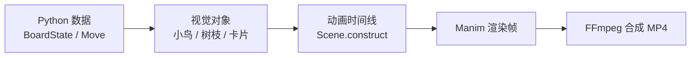

# 从零使用 ManimCE 制作动画

> 以本目录的 Beam Search 核心动画为完整案例

本文面向从未使用过 ManimCE 的读者。读完并完成文末练习后，你应该能够：

- 理解 ManimCE 如何把 Python 代码渲染成视频；
- 创建图形、文字、组合对象和基础动画；
- 使用坐标、相对布局、图层和颜色组织画面；
- 制作沿曲线路径移动、淡入淡出、变形和错峰出现等效果；
- 把业务数据转换成可动画的视觉对象；
- 编排一段有明确时长的完整场景；
- 使用低清预览调试，再输出 1920×1080 成片；
- 看懂并修改本项目的 [`beam_search_core.py`](./beam_search_core.py)。

本文对应的环境和成片：

- Manim Community Edition 0.19.0；
- Python 场景：[`beam_search_core.py`](./beam_search_core.py)；
- 最终视频：[`beam-search-core-1080p.mp4`](./beam-search-core-1080p.mp4)；
- 渲染脚本：[`render.sh`](./render.sh)；
- 项目配置：[`manim.cfg`](./manim.cfg)。

推荐阅读路线：

1. 第 1–6 节：先理解 ManimCE 并成功完成第一次渲染；
2. 第 7–17 节：学习坐标、图形、文字、组合、路径和动画节奏；
3. 第 18–22 节：理解当前 Beam Search 视频如何组织数据和时间线；
4. 第 23–31 节：开始修改项目、调试、练习并输出自己的版本。

## 1. ManimCE 是什么

ManimCE，全称 Manim Community Edition，是一个“用 Python 描述画面和时间线，再渲染为视频”的动画引擎。

它和普通剪辑软件的工作方式不同：

- 剪辑软件主要操作已经存在的视频、图片和音频；
- ManimCE 主要通过代码生成图形、文字、运动和镜头变化；
- 同一份代码可以重复渲染不同分辨率、帧率和颜色版本；
- 数据发生变化时，可以重新计算并生成动画，而不需要逐帧手工修改。

本项目的工作流程可以概括为：



ManimCE 特别适合：

- 数学和算法解释；
- 数据结构与搜索过程；
- 图表、流程和状态变化；
- 需要根据数据自动生成的动画；
- 视觉风格统一、可以反复修改的系列视频。

它不擅长直接替代完整剪辑软件。真人录屏、长篇配音、多轨音乐、复杂转场和调色，通常仍然交给 DaVinci Resolve、Premiere、剪映或 FFmpeg。

## 2. 先建立四个核心概念

第一次学习 ManimCE 时，先记住四个词即可。

### 2.1 Scene：场景和时间线

`Scene` 是一段动画的容器。场景中的全部制作步骤通常写在 `construct()` 方法里。

```python
from manim import *


class HelloScene(Scene):
    def construct(self):
        text = Text("你好，ManimCE")
        self.play(FadeIn(text), run_time=1)
        self.wait(2)
```

可以把 `construct()` 理解为按顺序执行的分镜表：

```text
创建文字 → 淡入 1 秒 → 停留 2 秒
```

本项目的主场景是 `BeamSearchCore(Scene)`，位于 `beam_search_core.py` 第 575 行附近。

### 2.2 Mobject：画面上的对象

Mobject 是 Manim 中所有可见对象的基础概念。例如：

- `Circle`：圆；
- `Ellipse`：椭圆；
- `Rectangle`：矩形；
- `RoundedRectangle`：圆角矩形；
- `Line`：线；
- `Arrow`：箭头；
- `Polygon`：任意多边形；
- `Text`：普通文字；
- `ImageMobject`：位图；
- `SVGMobject`：SVG 矢量图。

创建对象并不会自动让它出现：

```python
circle = Circle()
```

需要把它添加到场景，或者播放它的出现动画：

```python
self.add(circle)                  # 立即出现
self.play(Create(circle))         # 沿轮廓绘制出现
self.play(FadeIn(circle))         # 淡入
self.play(GrowFromCenter(circle)) # 从中心长出来
```

### 2.3 Animation：对象如何发生变化

Animation 描述 Mobject 在一段时间内如何变化。

```python
self.play(circle.animate.shift(RIGHT * 2), run_time=1)
self.play(circle.animate.set_color(RED), run_time=0.5)
self.play(FadeOut(circle), run_time=0.6)
```

其中 `.animate` 适合简单属性变化，例如移动、缩放、旋转、变色和透明度变化。

更具体的动画类适合表达明确语义：

```python
Create(line)
FadeIn(text)
FadeOut(card)
ReplacementTransform(old_title, new_title)
MoveAlongPath(bird, path)
```

### 2.4 VGroup：把多个对象组合成一个对象

当前视频中的一只鸟由彩色圆形和字母组成。可以使用 `VGroup` 把它们组合起来：

```python
bird = VGroup(circle, letter)
bird.scale(0.8)
bird.shift(RIGHT * 2)
```

之后对 `bird` 的缩放和移动会同时作用于所有子对象。

本项目大量使用 `VGroup`：

- 一个小鸟是一个 `VGroup`；
- 一根树枝是一个 `VGroup`；
- 一个候选棋盘卡片是一个 `VGroup`；
- 一组候选卡片又组成更大的 `VGroup`。

这种嵌套结构是 ManimCE 项目保持可维护性的关键。

## 3. 当前目录结构

```text
video/
├── beam_search_core.py              # 主动画源码
├── manim.cfg                        # 分辨率、帧率和输出目录配置
├── render.sh                        # 一键最终渲染
├── beam-search-core-1080p.mp4       # 最终成片
├── beam-search-core-thumbnail.png   # 缩略图
├── README.md                        # 简要使用说明
├── ManimCE从零到项目实战.md          # 本文
└── media/                            # Manim 中间文件，已被 Git 忽略
```

源代码各部分的职责如下：

| 大致行号 | 内容 | 作用 |
|---:|---|---|
| 1–45 | 导入与项目路径 | 引入 Manim、NumPy 和游戏模型 |
| 48–70 | 时长、字体和调色板 | 统一视频视觉风格 |
| 73–120 | 教学棋盘、移动路径和验证 | 保证故事中的卡死与解法真实有效 |
| 123–174 | 文字与背景函数 | 生成中文文字、天空和云朵 |
| 177–201 | `BirdIcon` | 使用圆形和字母制作鸟类型标记 |
| 204–215 | `make_branch` | 制作左右镜像的横线树枝和固定端竖线 |
| 218–342 | `BirdBoard` | 把棋盘状态转换为可动画对象 |
| 345–415 | `SnapshotCard` | 制作 Beam Search 的候选状态缩略图 |
| 418–450 | 评分与下一层搜索 | 生成真实候选状态并保留前三名 |
| 453–498 | UI 辅助组件 | 徽章和最终对比卡片 |
| 501 行以后 | `BeamSearchCore` | 编排完整的 75 秒时间线 |

建议学习时先从 `BeamSearchCore.construct()` 阅读，再回头看它调用的组件。这样会先理解“视频做了什么”，再理解“组件如何实现”。

## 4. 检查运行环境

当前电脑已经安装 ManimCE 和 FFmpeg。进入项目目录后可以检查：

```bash
manim --version
ffmpeg -version
ffprobe -version
```

当前验证版本为：

```text
Manim Community v0.19.0
FFmpeg 8.0.1
```

还可以运行：

```bash
manim checkhealth
```

### 4.1 在新的 macOS 环境中安装

如果未来在另一台 Mac 上重新配置，可以使用独立虚拟环境：

```bash
brew install cairo pango ffmpeg pkg-config

python3 -m venv .venv-manim
source .venv-manim/bin/activate
python -m pip install --upgrade pip
python -m pip install manim==0.19.0
```

验证：

```bash
manim --version
manim checkhealth
```

不同操作系统的 Cairo、Pango 和 LaTeX 安装方式不同。如果不在当前 macOS 环境中，优先参考 ManimCE 对应版本的官方安装文档。

### 4.2 确认使用的是 ManimCE

ManimCE 和 3Blue1Brown 自用的 ManimGL 不是同一个包：

| 项目 | ManimCE | ManimGL |
|---|---|---|
| 导入 | `from manim import ...` | `from manimlib import ...` |
| 命令 | `manim` | `manimgl` |
| 本项目 | 使用 | 不使用 |

如果复制网络教程时看到 `manimlib` 或 `InteractiveScene`，不要直接混入当前代码。

## 5. 第一次渲染当前项目

### 5.1 最简单的最终渲染

在项目根目录运行：

```bash
cd video
bash render.sh
```

脚本会：

1. 切换到 `video/` 目录；
2. 创建一个可写的字体缓存目录；
3. 使用 Cairo 渲染器生成 1920×1080、30fps 的原始 MP4；
4. 使用 FFmpeg 把视频精确裁到 75 秒；
5. 输出 `beam-search-core-1080p.mp4`。

### 5.2 真正的低清预览

本项目的 `manim.cfg` 固定了 1920×1080 和 30fps。为了确保预览一定使用低清规格，建议显式覆盖分辨率和帧率：

```bash
cd video

XDG_CACHE_HOME=/tmp/suanniao-manim-cache \
  manim \
  --config_file manim.cfg \
  --renderer cairo \
  -r 854,480 \
  --fps 15 \
  -o beam-search-preview \
  beam_search_core.py BeamSearchCore
```

命令最后两个参数最重要：

```text
beam_search_core.py  # Python 文件
BeamSearchCore       # 要渲染的 Scene 类名
```

只修改代码但忘记写正确的 Scene 类名，是新手最常见的问题之一。

### 5.3 只渲染最后一帧

检查布局时不一定要等待完整视频：

```bash
XDG_CACHE_HOME=/tmp/suanniao-manim-cache \
  manim --config_file manim.cfg -s beam_search_core.py BeamSearchCore
```

`-s` 表示只保存最后一帧。

### 5.4 只渲染部分动画

Manim 可以按动画编号渲染：

```bash
manim --config_file manim.cfg -n 20,30 beam_search_core.py BeamSearchCore
```

这适合调试视频中间的一小段。动画编号可以从渲染日志中的 `Animation 20`、`Animation 21` 等信息判断。

## 6. 从一个最小场景开始理解

下面是当前项目的极简版本：

```python
from manim import FadeIn, Scene, Text


class MiniBeamSearch(Scene):
    def construct(self):
        title = Text("多考虑几个未来")
        self.play(FadeIn(title), run_time=1)
        self.wait(2)
```

执行：

```bash
manim -pql mini_scene.py MiniBeamSearch
```

逐行理解：

1. 从 `manim` 导入需要的类；
2. 创建一个继承 `Scene` 的类；
3. 在 `construct()` 中创建文字；
4. 用 `self.play()` 播放动画；
5. 用 `self.wait()` 控制停留时间。

本项目虽然有近千行，但本质仍然是不断重复这五步。

## 7. 坐标系、像素和画面尺寸

Manim 中的位置通常不直接使用像素，而使用场景坐标。

默认 16:9 场景大约是：

```text
X：-7.11 到 7.11
Y：-4.00 到 4.00
中心：(0, 0, 0)
```

方向常量：

```python
ORIGIN  # [0, 0, 0]
RIGHT   # [1, 0, 0]
LEFT    # [-1, 0, 0]
UP      # [0, 1, 0]
DOWN    # [0, -1, 0]
UR      # 右上
DR      # 右下
```

例如：

```python
circle.move_to(RIGHT * 3 + UP * 1.5)
circle.shift(LEFT * 0.5)
title.to_edge(UP, buff=0.34)
badge.to_corner(UR, buff=0.42)
```

这些方法的区别：

- `move_to()`：移动到一个绝对位置；
- `shift()`：相对当前位置移动；
- `next_to()`：放在另一个对象旁边；
- `to_edge()`：贴近画面某条边；
- `to_corner()`：贴近画面某个角。

本项目在 `branch_positions()` 中直接定义六根树枝的中心坐标：

```python
return (
    np.array([-3.65, 1.85, 0.0]),
    np.array([3.65, 1.85, 0.0]),
    np.array([-3.65, 0.0, 0.0]),
    np.array([3.65, 0.0, 0.0]),
    np.array([-3.65, -1.85, 0.0]),
    np.array([3.65, -1.85, 0.0]),
)
```

这相当于手工建立一个两列三行的布局。

### 7.1 像素尺寸和场景坐标不是一回事

当前项目通过 `manim.cfg` 或命令行设置输出视频像素：

```ini
[CLI]
pixel_width = 1920
pixel_height = 1080
frame_rate = 30
```

它不会把坐标系变成 `0–1920` 和 `0–1080`。场景仍然使用约 `14.22 × 8` 的逻辑坐标，只是渲染时映射到更多像素。

因此，同一段布局代码可以输出 480p、1080p 或 4K。

## 8. 颜色、填充、轮廓和透明度

本项目把主要颜色集中定义在文件顶部：

```python
SKY = ManimColor("#BDEBFA")
INK = ManimColor("#23364A")
KEEP = ManimColor("#2FA36B")
DANGER = ManimColor("#E05B52")
GOLD = ManimColor("#F4B942")
```

这是推荐做法。不要在几百个对象中重复散落十六进制颜色。

创建图形时通常需要同时考虑：

```python
Circle(
    radius=0.34,
    fill_color=DANGER,
    fill_opacity=0.10,
    stroke_color=DANGER,
    stroke_width=2.8,
)
```

含义：

- `fill_color`：内部颜色；
- `fill_opacity`：内部透明度，`0` 完全透明，`1` 完全不透明；
- `stroke_color`：轮廓颜色；
- `stroke_width`：轮廓宽度。

修改已经创建的对象：

```python
card.set_fill(WHITE, opacity=0.9)
card.set_stroke(KEEP, width=4)
card.set_opacity(0.2)
```

本项目不只依靠红色和绿色区分结果，还同时使用叉号、对勾、透明度和边框，避免颜色成为唯一信息来源。

## 9. 中文文字和字体

项目通过一个统一的辅助函数创建文字：

```python
def label(text: str, size: int = 42, color=INK, weight="SEMIBOLD") -> Text:
    return Text(text, font=FONT, font_size=size, color=color, weight=weight)
```

字体定义为：

```python
FONT = "Hiragino Sans GB"
```

集中封装有三个优点：

- 全片字体一致；
- 修改字号和字重更方便；
- 替换字体时只修改一处。

检查系统中文字体：

```bash
fc-list ':lang=zh' family | sort -u
```

如果出现中文方框、缺字或字体错误，可以先换成：

```python
FONT = "Arial Unicode MS"
```

或者系统中存在的其他中文字体。

### 9.1 字体缓存权限问题

某些环境会出现：

```text
Fontconfig error: No writable cache directories
```

当前渲染脚本通过环境变量指定可写缓存目录：

```bash
XDG_CACHE_HOME="$CACHE_DIR" manim ...
```

手工运行时也建议带上：

```bash
XDG_CACHE_HOME=/tmp/suanniao-manim-cache manim ...
```

## 10. 用圆形和字母表示同类鸟

`BirdIcon` 是理解“如何用 Manim 组合图形和文字”的最佳入口。

它继承 `VGroup`：

```python
class BirdIcon(VGroup):
    def __init__(self, bird_type: int, scale_factor: float = 1.0):
        super().__init__()
```

字母鸟由以下对象组成：

| 部分 | Manim 对象 |
|---|---|
| 彩色底 | `Circle` |
| 类型字母 | `Text` |
| 整体对象 | `VGroup` |

圆形使用 `BIRD_COLORS` 中的类型颜色，字母使用 `A`、`B`、`C`、`D`：

```python
self.add(body, letter)
self.scale(scale_factor)
```

此后可以像操作一个普通对象一样操作小鸟：

```python
bird = BirdIcon(2)
bird.move_to(LEFT * 2)
self.play(FadeIn(bird))
self.play(bird.animate.shift(RIGHT * 4))
```

### 10.1 为什么使用圆形字母

这种抽象表示的优点：

- 同类鸟只需要相同字母，算法含义非常明确；
- 左右镜像后不需要处理鸟头朝向；
- 缩略卡片中仍然容易辨认；
- 任意缩放仍然清晰；
- 不依赖外部素材文件。

PNG 也可以使用：

```python
from manim import ImageMobject

bird = ImageMobject("bird.png")
bird.scale(0.5)
```

如果使用 PNG，最好提供透明背景和足够高的分辨率。

## 11. 左右镜像树枝、固定端和 z-index

每根树枝由一条横线和一条竖线组成：

```python
horizontal = Line(start, end, color=WOOD, stroke_width=8)
fixed_cap = Line(fixed_point + DOWN * 0.12, fixed_point + UP * 0.78)
```

横线代表树枝，竖线代表这一端被封住，不能从这里移出。

六根树枝按左右两列排列：

- 左侧树枝：固定端在左，可移动端朝右、朝向画面中心；
- 右侧树枝：固定端在右，可移动端朝左、朝向画面中心；
- `BoardState` 中的元组始终保持“固定端 → 可移动端”；
- 因此右侧树枝的视觉槽位必须反向排列。

代码先判断树枝位于哪一侧：

```python
side = "left" if index % 2 == 0 else "right"
```

再计算从固定端指向中心的方向：

```python
fixed_slot = center + (LEFT if side == "left" else RIGHT) * 1.22
toward_center = RIGHT if side == "left" else LEFT
```

树枝和小鸟可能在添加顺序上互相遮挡，因此代码显式设置图层：

```python
branch_group.set_z_index(0)
bird.set_z_index(2)
```

规则是：z-index 越大，越靠近观众。

常见层级可以约定为：

```text
-10  背景
  0  树枝、卡片底板
  1  高亮和连线
  2  小鸟、主要图形
  5  文字、提示
```

## 12. 从业务数据生成棋盘

动画不是手工摆放 16 只固定小鸟，而是读取项目真实数据结构：

```python
INITIAL_STATE = BoardState(
    (
        (0, 3, 3, 2),
        (1, 2, 1, 2),
        (3, 1, 0, 0),
        (3, 1, 0, 2),
        (),
        (),
    ),
    capacity=4,
)
```

每个元组代表一根树枝，从固定端排到可移动端：

```text
(0, 3, 3, 2)
 固定端     外端
```

`BirdBoard` 负责把这个状态转换成视觉对象：

```python
board = BirdBoard(INITIAL_STATE)
self.add(board.group)
```

它内部保存：

- `positions`：六根树枝的位置；
- `slot_points`：每根树枝四个鸟位的位置；
- `branch_groups`：六个树枝图形；
- `birds`：按树枝分组的小鸟对象列表；
- `group`：整个棋盘的总组合。

这种结构分离了两类状态：

```text
BoardState 负责“游戏逻辑是否正确”
BirdBoard  负责“画面上的对象在哪里”
```

动画项目中应尽量避免让视觉代码自己猜业务规则。

## 13. 让小鸟沿曲线飞行

移动动画的核心是：

```python
path = ArcBetweenPoints(
    bird.get_center(),
    target,
    angle=-PI / 3,
)

animation = MoveAlongPath(
    bird,
    path,
    rate_func=ease_in_out_cubic,
)
```

`ArcBetweenPoints` 根据起点、终点和弯曲角度创建一条弧线。

常见角度效果：

```text
angle = 0        接近直线
angle = PI / 4   向一个方向弯曲
angle = -PI / 4  向相反方向弯曲
angle = PI / 2   更明显的半圆弧
```

`MoveAlongPath` 让对象沿路径移动。

本项目根据目标树枝在上方还是下方，选择不同弯曲方向，从而减少飞行路径互相穿过。

### 13.1 同时搬运多只鸟

当一次移动包含多只同类鸟时，代码为每只鸟建立一条路径：

```python
flights = []
for bird in moving:
    flights.append(MoveAlongPath(bird, path))
```

再用 `AnimationGroup` 同时播放：

```python
AnimationGroup(*flights, lag_ratio=0.08)
```

`lag_ratio=0.08` 表示后一个动画稍晚开始，形成轻微的跟随感，而不是所有鸟完全重叠飞行。

## 14. 动画完成后同步数据

`BirdBoard.move_animation()` 中的顺序非常重要：

```text
1. 找出要移动的小鸟对象
2. 计算目标槽位
3. 播放飞行动画
4. 更新视觉对象列表
5. 调用 BoardState.apply 更新逻辑状态
6. 如果凑齐四只，播放消除动画
```

对应代码：

```python
self.birds[move.source] = self.birds[move.source][:-move.count]
self.birds[move.destination].extend(moving)
self.state = self.state.apply(move)
```

如果先修改列表，再从列表中寻找要移动的对象，很容易造成鸟数量、槽位和逻辑状态不一致。

这是数据驱动动画中很重要的原则：

> 先保存动画所需的旧状态和对象引用，播放动画后再提交新状态。

## 15. Create、FadeIn、animate 和 ReplacementTransform

当前动画使用了几类常见效果。

### 15.1 Create

适合线、箭头和边框：

```python
self.play(Create(title_bar))
self.play(Create(connector))
```

它会沿对象路径逐步绘制。

### 15.2 FadeIn / FadeOut

适合快速引入和移除对象：

```python
self.play(FadeIn(card, shift=UP * 0.18))
self.play(FadeOut(card))
```

`shift` 表示对象在淡入时还会发生少量位移。

### 15.3 `.animate`

适合简单属性变化：

```python
candidate_cards[3].animate.set_opacity(0.2).scale(0.88)
```

这段代码同时改变透明度和大小。

### 15.4 ReplacementTransform

适合“旧对象被新对象替换”的语义：

```python
self.play(ReplacementTransform(old_title, new_title))
```

和普通 `Transform` 的区别：

- `Transform(old, new)`：旧变量仍然是场景对象，只是外观看起来像新对象；
- `ReplacementTransform(old, new)`：旧对象离开，新对象成为场景中的正式对象。

项目中标题和阶段徽章不断变化，因此使用 `ReplacementTransform` 更容易维护变量关系。

## 16. AnimationGroup 和 LaggedStart

### 16.1 多个动画同时发生

把多个动画传给同一个 `self.play()`，它们会同时播放：

```python
self.play(
    FadeIn(title),
    Create(title_bar),
    run_time=1.2,
)
```

### 16.2 多个对象依次错峰出现

```python
LaggedStart(
    *[FadeIn(card) for card in candidate_cards],
    lag_ratio=0.1,
)
```

适合：

- 多只鸟依次出现；
- 多张候选卡片依次进入；
- 多颗星星依次绽放；
- 多条搜索连线依次绘制。

经验值：

- `0`：完全同时；
- `0.03–0.12`：自然、紧凑；
- `0.2–0.5`：明显依次出现；
- `1`：前一个完成后才开始下一个。

## 17. 缓动函数决定运动质感

`rate_func` 决定动画在时间上的速度变化。

本项目使用：

```python
from manim.utils.rate_functions import (
    ease_in_out_cubic,
    ease_out_back,
    ease_out_cubic,
)
```

用途：

- `ease_in_out_cubic`：起步和停止都平滑，用于飞行；
- `ease_out_cubic`：快速开始、平滑停止，用于消除；
- `ease_out_back`：到终点前略微越过再回来，用于活泼弹性效果。

ManimCE 0.19 中并非所有 easing 函数都能直接从 `manim` 顶层导入。如果出现：

```text
ImportError: cannot import name 'ease_in_out_cubic' from 'manim'
```

应改为：

```python
from manim.utils.rate_functions import ease_in_out_cubic
```

不要因为某个网络示例可以顶层导入，就假设当前版本也一定可以。

## 18. 如何把 Beam Search 画出来

完整棋盘适合展示鸟的移动，但不适合同时显示大量候选状态。因此项目还定义了 `SnapshotCard`。

它用更简单的图形表达同一个 `BoardState`：

- 圆角矩形作为卡片；
- 细线作为树枝；
- 带字母的小圆形作为迷你鸟类型；
- 已消除树枝使用绿色虚线。

创建四个候选状态：

```python
candidate_states = [INITIAL_STATE.apply(move) for move in candidate_moves]

candidate_cards = VGroup(
    *[SnapshotCard(state) for state in candidate_states]
).arrange(RIGHT, buff=0.32)
```

`arrange(RIGHT)` 会把卡片自动横向排列。比手工为每张卡片计算坐标更容易维护。

### 18.1 展开

根状态放在上方，四个候选放在下方，并用箭头连接：

```python
Arrow(root_card.get_bottom(), card.get_top())
```

### 18.2 评分

代码为候选状态计算排序指标：

```python
return (
    state.removed_count,
    -runs,
    uniform_weight,
    -locked_mixed,
    empty_count,
)
```

这些元组按字典序比较。动画不显示公式，只显示排名数字。

### 18.3 保留

前三名增加绿色边框，第四名降低透明度并显示叉号：

```python
candidate_cards[3].animate.set_opacity(0.2).scale(0.88)
```

### 18.4 重复

`next_beam()` 会从保留状态继续生成下一层真实候选：

```python
next_candidates, next_survivors = next_beam(kept_states, width=3)
```

这意味着视频中的第二层搜索不是装饰性随机卡片，而是由当前游戏规则计算出来的真实状态。

## 19. 场景编排：construct 就是分镜表

`BeamSearchCore.construct()` 的主要阶段如下：

| 阶段 | 画面内容 |
|---|---|
| 开场 | 标题、天空背景、六根树枝和小鸟出现 |
| 束宽 1 | 强调“看起来最好”的移动 |
| 卡死 | 两步后没有合法移动，显示红叉和抖动 |
| 倒放 | 两个移动逆向播放，回到初始状态 |
| 束宽 3 | 一个状态展开为四个候选 |
| 评分与保留 | 排名、绿色边框和灰色剪枝 |
| 重复搜索 | 下一层候选继续展开和剪枝 |
| 完整解 | 播放经过验证的 12 步路径 |
| 结果 | 全部消除和庆祝粒子 |
| 对比 | 束宽 1、3、全部搜索 |
| 结尾 | “多考虑几个未来 / Beam Search” |

代码中的顺序就是视频中的时间顺序，因此可以按阶段折叠阅读，而不必一次理解所有组件。

## 20. 精确控制 75 秒时间线

普通 Manim 代码会直接调用：

```python
self.play(..., run_time=1)
self.wait(2)
```

本项目额外封装了：

```python
def tplay(self, *animations, run_time: float = 1.0, **kwargs):
    self.play(*animations, run_time=run_time, **kwargs)
    self.elapsed += run_time

def twait(self, duration: float):
    self.wait(duration)
    self.elapsed += duration
```

这样每次播放和停留都会累计到 `self.elapsed`。

结尾计算剩余时长：

```python
remaining = TARGET_DURATION - self.elapsed

if remaining < -0.01:
    raise RuntimeError("Timeline is too long")

if remaining > 0:
    self.twait(remaining)
```

优点：

- 修改中间某段动画后，结尾仍然自动补齐；
- 如果时间线超过目标，会立即报错；
- 不需要手工反复相加几十个时间值。

### 20.1 为什么最终还要 FFmpeg 裁切

Manim 的内部时间线为 75.00 秒，但媒体封装、拼接和尾帧可能让生成文件略长，例如 75.4 秒。

因此 `render.sh` 最后执行：

```bash
ffmpeg \
  -i "$RAW_OUTPUT" \
  -t 75.000 \
  -c:v libx264 \
  -pix_fmt yuv420p \
  -movflags +faststart \
  beam-search-core-1080p.mp4
```

最终文件经过验证为准确的 75.000000 秒。

## 21. manim.cfg、源码配置和命令行谁优先

Manim 配置的优先级一般是：

```text
命令行参数
    ↓
项目 manim.cfg
    ↓
用户全局配置
    ↓
Manim 默认配置
```

当前 `manim.cfg`：

```ini
[CLI]
pixel_width = 1920
pixel_height = 1080
frame_rate = 30
background_color = #BDEBFA
media_dir = ./media
format = mp4
progress_bar = display
```

源码不直接写死输出像素和帧率，因此命令行可以覆盖配置并生成真正的低清预览。

最终渲染脚本再次通过命令行设置：

```bash
-r 1920,1080
--fps 30
```

这种重复是有意的防御性配置：无论用户从哪个目录或哪种方式运行，都尽量保持成片规格一致。

## 22. Cairo 和 OpenGL 渲染器

ManimCE 常用两种渲染器：

### Cairo

- 稳定；
- 适合 2D 矢量图；
- 最终输出一致性好；
- 当前项目使用。

```bash
manim --renderer cairo ...
```

### OpenGL

- 适合交互预览和 3D；
- 某些效果与 Cairo 存在差异；
- 当前项目没有必要使用。

初学时建议先使用 Cairo，除非明确需要 3D 或实时交互。

## 23. 如何修改当前动画

### 23.1 修改标题文字

搜索：

```python
label("只看眼前，会发生什么？", size=48)
```

直接替换字符串即可。文字变长后，需要检查是否超出画面。

### 23.2 修改整体配色

修改文件顶部的颜色常量：

```python
SKY = ManimColor("#BDEBFA")
KEEP = ManimColor("#2FA36B")
DANGER = ManimColor("#E05B52")
```

不要逐个修改每个对象。

### 23.3 修改小鸟颜色

```python
BIRD_COLORS = (
    ManimColor("#4E79A7"),
    ManimColor("#F2BE42"),
    ManimColor("#E76F51"),
    ManimColor("#7A5195"),
)
```

数组索引必须和棋盘中的鸟类型 `0–3` 对应。

### 23.4 修改小鸟造型

进入 `BirdIcon.__init__()`，可以修改：

- 圆形的 `radius`；
- 圆形的轮廓宽度；
- 字母的 `font_size` 和字重；
- 不同颜色上的文字颜色。

建议一次只改一个部位，并先渲染最后一帧或一个单独测试 Scene。

### 23.5 修改树枝布局

修改 `branch_positions()`。

例如整体向上移动：

```python
position + UP * 0.4
```

修改列间距时，要同时观察鸟飞行路径是否互相遮挡。

### 23.6 修改初始残局

修改 `INITIAL_STATE`：

```python
INITIAL_STATE = BoardState(
    (
        (...),
        (...),
        (),
        (),
    ),
    capacity=4,
)
```

然后必须重新生成：

- `GREEDY_MOVES`；
- `SOLUTION_MOVES`；
- 第一层 `candidate_moves`；
- 可能依赖候选数量的视觉布局。

不要只换棋盘而保留旧移动路径。

### 23.7 修改束宽

搜索：

```python
next_beam(kept_states, width=3)
```

如果改成 4，还需要同步修改：

- “束宽 3”文字；
- “保留 3 个”文字；
- 绿色边框数量；
- 顶部幸存卡片布局；
- 最终对比卡片。

动画中的数字、算法数据和视觉数量必须保持一致。

### 23.8 修改视频总时长

```python
TARGET_DURATION = 75.0
```

同时修改 `render.sh` 中：

```bash
-t 75.000
```

只修改一处会导致源码时间线和最终输出不一致。

### 23.9 调整某个动作速度

```python
board.move_animation(
    self,
    move,
    move_time=0.92,
    completion_time=0.48,
)
```

- `move_time`：鸟飞行的时间；
- `completion_time`：四只凑齐后的消除时间。

如果动作太快，不要只增加 `wait()`；优先延长动作本身，让运动更容易看清。

## 24. 为动画加入图片、SVG 和音频

当前核心动画是纯矢量和无声版本。后续可以扩展。

### 24.1 图片

```python
from manim import ImageMobject

screenshot = ImageMobject("../game.jpg")
screenshot.scale_to_fit_height(6)
self.play(FadeIn(screenshot))
```

### 24.2 SVG

```python
from manim import SVGMobject

icon = SVGMobject("bird.svg")
icon.set_color(BLUE)
```

### 24.3 音频

Manim 可以在时间线上添加音频：

```python
self.add_sound("click.wav")
```

但正式视频通常建议：

1. 先输出无声动画；
2. 单独录制旁白；
3. 使用 FFmpeg 或剪辑软件完成混音；
4. 根据旁白重新微调 Manim 时间线。

这样比把所有音轨直接写死在 Python 场景中更容易迭代。

## 25. 推荐的开发循环

不要每次修改一个颜色就完整渲染 1080p 视频。推荐流程：

```text
修改一小处
    ↓
语法检查
    ↓
低清或局部渲染
    ↓
查看关键帧
    ↓
完整低清预览
    ↓
最终 1080p 渲染
    ↓
ffprobe / 完整解码验证
```

### 25.1 语法检查

Manim 当前安装在对应的 Python 环境中，可以运行：

```bash
python -m py_compile beam_search_core.py
```

如果 `python` 和 `manim` 来自不同环境，语法检查虽然可能通过，但执行时仍可能找不到 `manim`。使用下面命令检查：

```bash
which python
which manim
head -n 1 "$(which manim)"
```

### 25.2 清除错误缓存影响

如果修改代码后画面看起来仍像旧版本：

```bash
manim --disable_caching ...
```

或者换一个输出文件名。

### 25.3 检查最终视频规格

```bash
ffprobe \
  -v error \
  -show_entries format=duration:stream=codec_name,width,height,r_frame_rate,pix_fmt \
  -of default=noprint_wrappers=1 \
  beam-search-core-1080p.mp4
```

本项目应输出：

```text
codec_name=h264
width=1920
height=1080
pix_fmt=yuv420p
r_frame_rate=30/1
duration=75.000000
```

### 25.4 完整解码测试

```bash
ffmpeg -v error -i beam-search-core-1080p.mp4 -f null -
```

没有输出错误通常表示整个视频可以正常解码。

## 26. 常见错误及解决办法

### 26.1 `manim: command not found`

原因：Manim 没安装，或者安装环境没有激活。

检查：

```bash
which manim
python -m manim --version
```

### 26.2 `ModuleNotFoundError: No module named 'manim'`

原因：执行源码使用的 Python 和 `manim` 命令使用的 Python 不是同一个环境。

解决：激活正确虚拟环境，或者使用 Manim 所属 Python。

### 26.3 找不到 Scene

```text
No scenes found
```

确认类继承自 `Scene`：

```python
class BeamSearchCore(Scene):
```

并确认命令中的类名完全一致：

```bash
manim beam_search_core.py BeamSearchCore
```

### 26.4 中文显示成方框

确认字体存在，并修改：

```python
FONT = "系统中实际存在的中文字体名"
```

### 26.5 缓动函数无法导入

从：

```python
from manim import ease_in_out_cubic
```

改成：

```python
from manim.utils.rate_functions import ease_in_out_cubic
```

### 26.6 对象出现在错误图层

使用：

```python
object.set_z_index(2)
```

检查背景、树枝、小鸟和提示框的 z-index。

### 26.7 `Transform` 后变量关系混乱

如果旧对象应该彻底被新对象替代，使用：

```python
ReplacementTransform(old, new)
```

完成后继续使用 `new` 变量。

### 26.8 修改残局后运行时报错

项目启动时会执行 `validate_story_data()`：

- 贪心路径必须在两步后没有合法移动；
- 12 步解法必须完全清空棋盘。

修改残局或路径后验证失败是正确行为，它能防止渲染出逻辑错误的视频。

### 26.9 输出不是预期的低清规格

当前项目配置明确设置了 1920×1080。不要只依赖 `-ql`，显式传入：

```bash
-r 854,480 --fps 15
```

### 26.10 视频时长比 Scene 时间略长

这是容器拼接和尾帧造成的常见现象。使用 `render.sh` 中的 FFmpeg 步骤精确裁切。

## 27. 建议按这个顺序练习

### 练习 1：修改一个标题

把：

```text
只看眼前，会发生什么？
```

改成：

```text
贪心选择一定正确吗？
```

只渲染最后一帧或相关局部，观察位置是否需要调整。

### 练习 2：修改天空颜色

修改 `SKY`，重新渲染一个关键帧。

目标：理解集中式调色板。

### 练习 3：修改一种字母鸟的样式

修改 `BirdIcon` 中某个 `bird_type` 的圆形轮廓或字母颜色。

目标：理解基础形状和 `VGroup`。

### 练习 4：修改树枝间距

修改 `branch_positions()` 的 X 或 Y 坐标。

目标：理解 Manim 坐标系和布局。

### 练习 5：改变飞行弧度

把 `PI / 3` 改成 `PI / 5`，比较小鸟飞行轨迹。

目标：理解路径动画。

### 练习 6：改变错峰时间

把 `lag_ratio=0.08` 分别改为 `0` 和 `0.3`。

目标：理解 `AnimationGroup` 的时间关系。

### 练习 7：制作独立的 BirdDemo Scene

在同一个 Python 文件中增加：

```python
class BirdDemo(Scene):
    def construct(self):
        birds = VGroup(*[BirdIcon(index) for index in range(4)])
        birds.arrange(RIGHT, buff=0.5)
        self.play(LaggedStart(*[FadeIn(bird) for bird in birds], lag_ratio=0.15))
        self.wait(2)
```

渲染：

```bash
manim -r 854,480 --fps 15 beam_search_core.py BirdDemo
```

目标：学会一个文件包含多个 Scene，并单独渲染指定 Scene。

### 练习 8：自己制作一个 10 秒算法片段

内容：一个根节点分裂成三个候选，只保留两个。

要求：

- 使用 `RoundedRectangle`；
- 使用 `Arrow`；
- 使用 `LaggedStart`；
- 使用透明度表示淘汰；
- 总时长约 10 秒。

完成这个练习后，你已经掌握了当前视频最核心的 ManimCE 技术。

## 28. 从当前项目继续扩展

熟悉现有代码后，可以逐步加入：

1. 旁白时间码；
2. 真实游戏截图到抽象棋盘的变形；
3. 当前搜索深度和候选数量；
4. 束宽滑块变化的动画；
5. 束宽 1、3、10 的同屏运行；
6. 从真实求解器日志自动生成整段动画；
7. 竖屏 1080×1920 版本；
8. 可复用的算法视频组件库。

如果需要竖屏版本，不只是修改像素尺寸，还需要重新设计坐标布局，因为搜索卡片在横屏中依赖较大的横向空间。

## 29. 最终渲染检查清单

渲染正式版本前逐项检查：

- [ ] `manim --version` 是预期的 ManimCE 版本；
- [ ] 中文字体正常；
- [ ] 初始残局和移动路径通过 `validate_story_data()`；
- [ ] 低清预览没有对象越界；
- [ ] 小鸟飞行过程中没有明显遮挡；
- [ ] 搜索候选数量与字幕一致；
- [ ] 红、绿之外还有叉号、对勾或透明度辅助表达；
- [ ] 所有 `self.play()` 都有合适的 `run_time`；
- [ ] 视频时长没有超过 `TARGET_DURATION`；
- [ ] `render.sh` 成功生成最终文件；
- [ ] `ffprobe` 显示 1920×1080、30fps、75 秒；
- [ ] FFmpeg 完整解码测试没有错误；
- [ ] 抽查开场、卡死、剪枝、完整解和结尾关键帧。

## 30. 常用命令速查

进入目录：

```bash
cd video
```

检查版本：

```bash
manim --version
manim checkhealth
```

低清预览：

```bash
XDG_CACHE_HOME=/tmp/suanniao-manim-cache \
  manim --config_file manim.cfg \
  -r 854,480 --fps 15 \
  -o beam-search-preview \
  beam_search_core.py BeamSearchCore
```

只渲染最后一帧：

```bash
XDG_CACHE_HOME=/tmp/suanniao-manim-cache \
  manim --config_file manim.cfg -s beam_search_core.py BeamSearchCore
```

关闭缓存：

```bash
manim --disable_caching beam_search_core.py BeamSearchCore
```

最终渲染：

```bash
bash render.sh
```

查看视频规格：

```bash
ffprobe -v error \
  -show_entries format=duration:stream=codec_name,width,height,r_frame_rate,pix_fmt \
  -of default=noprint_wrappers=1 \
  beam-search-core-1080p.mp4
```

完整解码测试：

```bash
ffmpeg -v error -i beam-search-core-1080p.mp4 -f null -
```

## 31. 学习本项目时最重要的三个结论

### 结论一：先设计数据，再设计动画

棋盘状态、合法移动和搜索评分来自真实代码，Manim 只负责把它们变得可见。这样动画既准确，又能随数据变化重新生成。

### 结论二：复杂画面来自简单对象的组合

字母鸟、树枝、棋盘和搜索卡片都由 `Circle`、`Line`、`Text`、`RoundedRectangle` 和 `VGroup` 等简单对象组成。不要一开始就追求复杂特效，先把对象结构设计清楚。

### 结论三：视频制作是时间线工程

一个对象画得好看只是第一步。真正决定视频是否易懂的是：什么先出现、停留多久、哪些动作同时发生、什么时候切换重点。`construct()` 就是把视觉设计转换成时间顺序的地方。

从当前项目开始，最好的阅读顺序是：

```text
BeamSearchCore.construct
        ↓
BirdBoard.move_animation
        ↓
BirdIcon / SnapshotCard
        ↓
BoardState / Move
        ↓
render.sh / manim.cfg
```

理解这条链路后，你就具备了独立制作数据驱动 ManimCE 动画的基础。
