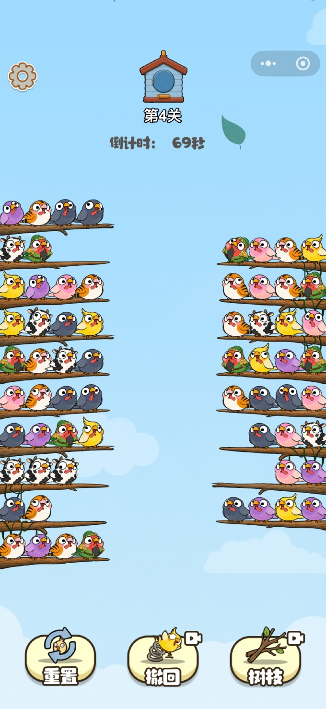
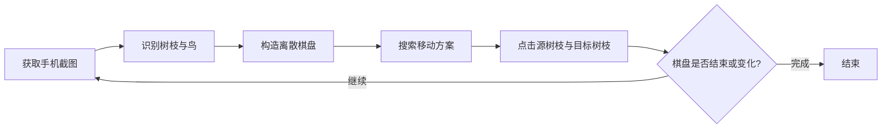
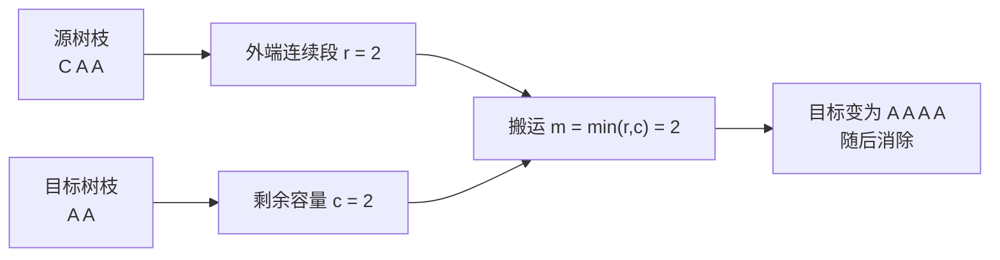
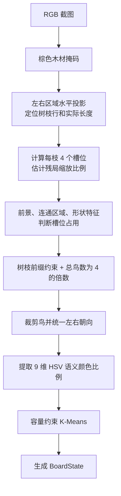
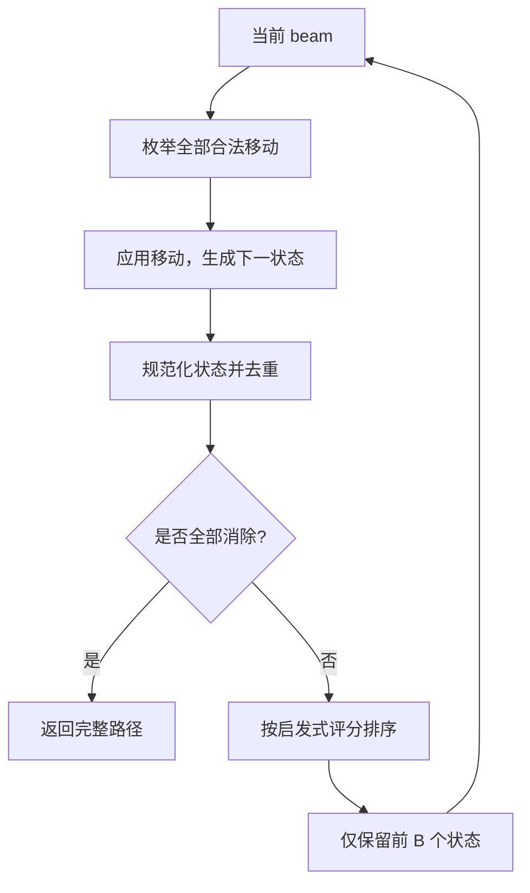
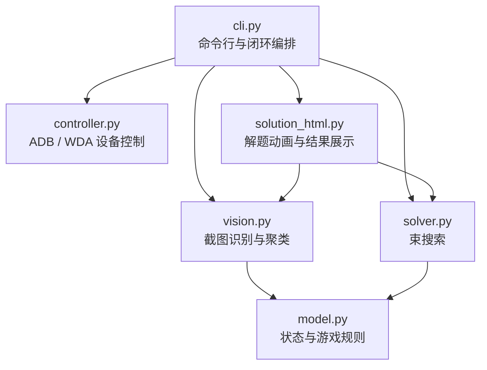
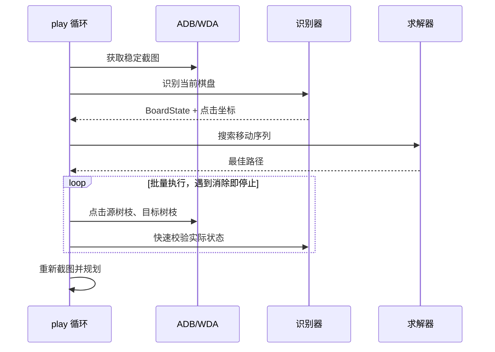

# 算鸟项目总结

> 一个面向手机“鸟类分组消除”小游戏的自动玩家：从截图中识别棋盘，搜索解法，并通过 Android ADB 或 iOS WebDriverAgent 自动点击。

## 1. 当前项目要解决的问题

### 1.1 游戏目标

<p align="center">
  
</p>

每根树枝最多容纳 4 只鸟，规则可简化为：

- 鸟按“树枝固定端 → 外端”排列，只有外端鸟可被移动。
- 一次操作会搬运外端连续的同类鸟，而不是只移动一只。
- 目标树枝必须为空，或外端鸟与待移动鸟同类。
- 目标空间不足时，只搬运能够放下的数量。
- 一根树枝凑齐 4 只同类鸟后立即消失。
- 最终目标是消除全部鸟，同时尽量减少误识别和无效点击。

### 1.2 项目需要完成的闭环



项目实际解决了三个子问题：

| 子问题 | 难点 | 当前方案 |
|---|---|---|
| 截图理解 | 分辨树枝、空槽、鸟类型和左右朝向 | 颜色分割、槽位检测、无监督聚类 |
| 解题规划 | 局部最优可能造成后续无空间可用 | 带剪枝和启发式评分的束搜索 |
| 真机执行 | 动画、点击失败、Retina 缩放、广告中断 | 稳定截图、状态校验、重规划、ADB/WDA 适配 |

## 2. 问题建模与解决算法

### 2.1 棋盘状态

设棋盘状态为：

$$
S=(B_1,B_2,\ldots,B_M)
$$

其中每根树枝是一个不可变元组：

```text
(0, 3, 2, 2)
 固定端       外端
```

- 整数表示鸟的类型，只要求“同类同编号”，不需要知道鸟的真实名称。
- 空树枝表示为 `()`。
- 已凑齐并消失的树枝表示为 `(-1,)`，不能再作为目标。
- 元组最后一个元素始终是可移动端。

这种不可变表示便于哈希、搜索去重和安全生成下一状态。

### 2.2 合法移动与状态转移

设源树枝外端连续同类鸟数量为 $r$，目标剩余容量为 $c$，实际搬运数量为：

$$
m=\min(r,c)
$$



合法条件：

1. 源树枝非空且未消失；
2. 目标树枝未满且未消失；
3. 目标为空，或目标外端与源鸟同类；
4. 若目标最终成为 4 只同类鸟，则转为 `REMOVED`。

优化目标按优先级表示为：

1. 最大化已消除树枝数；
2. 在未完全求解时，返回搜索过程中最好的可执行路径。

### 2.3 截图识别算法



核心步骤：

| 阶段 | 方法 | 作用 |
|---|---|---|
| 树枝检测 | 棕色阈值 + 水平投影 + 行峰值合并 | 避免引入训练模型，快速定位左右树枝 |
| 布局适配 | 树枝实际边界 + 同侧间距估计缩放 | 适配不同分辨率和残局鸟变大的情况 |
| 鸟存在性 | 背景差分、去木纹、连通区域面积与形状 | 区分鸟、藤蔓、树枝纹理和空槽 |
| 占用修正 | 每枝必须是连续前缀；总鸟数满足 $N\bmod4=0$ | 利用游戏规则纠正临界检测 |
| 朝向归一 | 右侧鸟水平翻转，统一裁剪尺寸 | 避免同一种鸟因镜像被拆成两类 |
| 特征提取 | 黑、白、灰、红、橙、黄、绿、蓝、紫 9 维比例 | 降低遮挡和背景对聚类的影响 |
| 类型识别 | K-Means + 容量约束 + 匈牙利分配 | 保证每类鸟数量是 4 的倍数 |
| 类型数选择 | 轮廓系数减去轻微的类别数惩罚 | 自动选择聚类数，避免过度拆分 |

容量约束聚类的目标是：

$$
\min \sum_i \lVert x_i-\mu_{z_i}\rVert^2,
\qquad |C_j|\in\{4,8,12,\ldots\}
$$

普通 K-Means 先提供中心；随后把中心复制为指定容量的槽位，用匈牙利算法完成全局最小成本分配，并迭代更新中心。

交互演示：[K-Means 聚类动画](./docs/k-means-animation.html)

### 2.4 束搜索求解

纯贪心只看当前能否合并，容易提前占满关键空树枝。项目使用束搜索，每层只保留评分最高的 $B$ 个候选状态。



状态评分采用字典序：

```python
(
    已消除树枝数,
    -颜色连续段总数,
    同色树枝长度平方和,
    -已塞满的混色树枝数,
    空树枝数,
)
```

这保证“多消除一根树枝”始终优先于局部形态优化。

主要剪枝：

- **对称状态归一化**：树枝排序后作为访问键，合并仅位置不同的等价状态。
- **等价空树枝剪枝**：多个空树枝只考虑第一个。
- **无效搬家剪枝**：不把整根纯色树枝原样搬到空树枝。
- **时间/深度/束宽限制**：控制指数级搜索的实际成本。

若树枝数为 $M$、束宽为 $B$、最大深度为 $D$，搜索展开的粗略复杂度为：

$$
O(DBM^2)
$$

实际还包含候选排序成本，但内存由束宽限制在可控范围内。

交互演示：[束搜索动画](./docs/beam-search-animation.html)

### 2.5 示例验证

使用仓库中的 [`game.jpg`](./game.jpg) 和当前代码进行验证：

| 指标 | 结果 |
|---|---:|
| 检测树枝 | 18 根 |
| 检测鸟数 | 64 只 |
| 自动识别类型 | 7 类 |
| 聚类规模 | `8, 8, 8, 8, 8, 12, 12` |
| 可消除目标 | 16 根 |
| 求解结果 | 完整求解 |
| 移动步数 | 46 步 |

可直接查看：[示例解题动画](./docs/game-solution.html)

## 3. 工程实现方案

### 3.1 总体架构



### 3.2 模块职责

| 文件 | 职责 |
|---|---|
| [`src/suanniao/vision.py`](./src/suanniao/vision.py) | 树枝检测、槽位占用、鸟裁剪、特征提取、容量约束聚类、调试报告 |
| [`src/suanniao/model.py`](./src/suanniao/model.py) | `BoardState`、`Move`、合法移动、状态转移、对称状态键 |
| [`src/suanniao/solver.py`](./src/suanniao/solver.py) | 束搜索、状态评分、最佳路径返回 |
| [`src/suanniao/controller.py`](./src/suanniao/controller.py) | Android ADB 与 iOS WDA 的截图、点击、坐标换算、中断处理 |
| [`src/suanniao/cli.py`](./src/suanniao/cli.py) | `analyze` / `play` 命令、循环调度、批量执行与重规划 |
| [`src/suanniao/solution_html.py`](./src/suanniao/solution_html.py) | 生成自包含 SVG/JavaScript 解题动画 |
| [`scripts/ios/run.sh`](./scripts/ios/run.sh) | 构建、签名、安装和启动 WDA，再启动自动玩家 |

### 3.3 两种运行模式

#### 离线分析

```bash
suanniao analyze game.jpg
```

输出：

- 识别后的棋盘和聚类统计；
- 求解步骤；
- `<图片名>-clusters/` 视觉调试报告；
- `<图片名>-solution.html` 可播放解题动画。

#### 真机自动运行

```bash
# Android
suanniao play

# iOS
scripts/ios/run.sh
```



### 3.4 可靠性设计

- 连续截图比较游戏区域，等待动画基本稳定。
- 每批最多执行若干步；发生整枝消除后立即重新识别。
- 从批次第二步开始快速截图，校验实际状态是否符合内存预期。
- 点击未生效或出现非棋盘画面时停止旧方案，清除残留选择并重规划。
- iOS 自动把 Retina 截图像素换算为 WDA 逻辑坐标。
- 只有在棋盘缺失时，才查找标签明确的“关闭/跳过广告”控件。
- 每轮可保存原图、检测标注、鸟裁剪、特征掩码、聚类候选和 JSON 报告。

### 3.5 技术栈与测试

| 类别 | 方案 |
|---|---|
| 语言 | Python 3.10+ |
| 图像处理 | Pillow、NumPy、SciPy |
| 聚类与评价 | scikit-learn K-Means、Silhouette Score |
| 约束分配 | SciPy Hungarian Algorithm |
| Android 自动化 | ADB |
| iOS 自动化 | WebDriverAgent HTTP API |
| 测试 | `unittest`，覆盖识别、模型/求解、CLI、设备控制和 HTML 输出 |

当前工作树本地验证结果：`38/38` 项测试通过。

安装与测试：

```bash
python3 -m venv .venv
source .venv/bin/activate
python -m pip install -e .
PYTHONPATH=src python3 -m unittest discover -s tests -v
```

### 3.6 当前边界

- 视觉阈值针对当前游戏皮肤和竖屏布局设计，并非通用目标检测器。
- 默认容量固定为 4；规则变化时需要同步调整模型和识别约束。
- 自动聚类依赖同类鸟视觉一致、每类总数为 4 的倍数。
- 搜索仍是指数问题；困难关卡需要提高束宽或时间限制。
- Android 当前不会自动识别广告关闭按钮；iOS 仅点击标签明确的安全控件。

## 4. 一句话总结

该项目用“**规则驱动视觉识别 + 容量约束无监督聚类 + 启发式束搜索 + 真机状态反馈**”完成了从一张游戏截图到自动执行完整解法的工程闭环。
